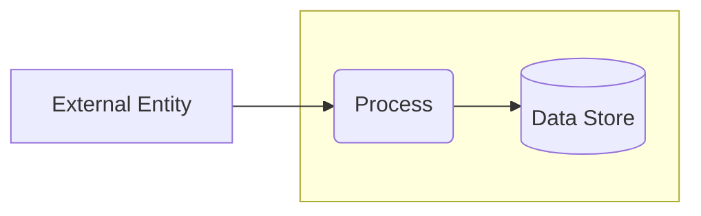

# Threat Model: <System Name>

**Status:** Draft · **Date:** <YYYY-MM-DD> · **Author(s):** <…>
**Next review trigger:** <e.g. next architecture change / before v2 / annual>

> Organized by the four questions. Keep it proportional to the system — delete sections
> you don't need rather than filling them with "not applicable". See `SKILL.md` §
> "Size the model to the system".

---

## 1. What are we working on?

### System description

<1–2 paragraphs: what it does, who uses it, where it runs.>

### Scope

**In scope:** <…>
**Out of scope:** <…>

### Assets

<The things actually worth protecting. Keep the list short — don't pad.>

| ID | Asset | Why it matters |
|----|-------|----------------|
| A1 |       |                |

### Trust levels

<Who has what access — e.g. anonymous, authenticated user, admin, service identity.>

### Assumptions

<Numbered and falsifiable, so they can be challenged and turned into test cases.>

1.

### Data flow diagram

### Trust boundaries

| Boundary | What crosses it | Mediating control |
|----------|-----------------|-------------------|
|          |                 |                   |

---

## 2. What can go wrong?

### STRIDE threats

| ID | Element | STRIDE | Threat | Likelihood | Impact | Risk |
|----|---------|--------|--------|------------|--------|------|
| T1 |         |        |        |            |        |      |
| T2 |         |        |        |            |        |      |

### Additional passes (optional — include only what the system needs)

<Delete this section if unused. Add a pass only when the system calls for it — e.g.
privacy (LINDDUN), business-logic abuse cases, data-centric, AI/ML, or an attack tree
on a key asset. See `references/methods.md`.>

---

## 3. What are we going to do about it?

| Threat ID | Risk | Response | Control / mitigation | Owner |
|-----------|------|----------|----------------------|-------|
| T1        |      | Mitigate |                      |       |
| T2        |      | Accept   | <rationale + who accepted> |  |

### Derived security requirements (optional)

> Include if the team wants testable requirements tracked in an issue tracker.

- **SR-1:** The system SHALL <testable requirement>. — mitigates T1, T3.

---

## 4. Did we do a good enough job?

- [ ] The DFD matches what is actually built or planned.
- [ ] Every threat has a response decision.
- [ ] Every "Mitigate" has a concrete control; high risks have an owner.
- [ ] Threats are filed where the team will act on them (issue tracker, not just this doc).

**Open questions / to validate:**

-

**Next review trigger:** <event or interval that should prompt re-modeling>

### Changelog

| Version | Date | Author | Changes |
|---------|------|--------|---------|
| 0.1     |      |        | Initial draft |
