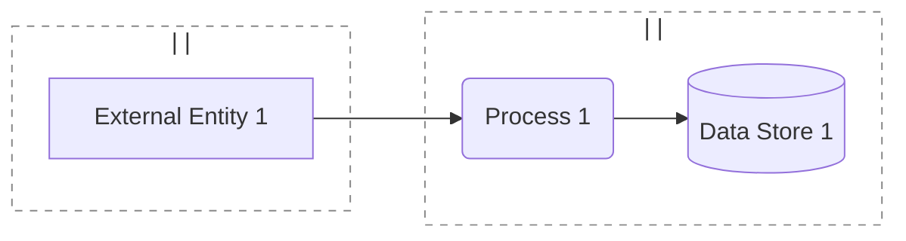
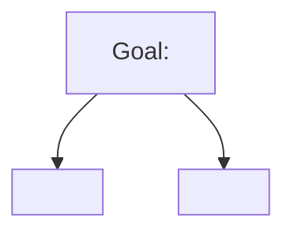

# Threat Model: <System Name>

**Version**: 0.1
**Date**: <YYYY-MM-DD>
**Author(s)**:
**Reviewer(s)**:
**Status**: Draft / Internal / Reviewed / Approved

**Configuration baseline** — bind this TM to a specific system release so verification activities and findings are anchored:
- **System release / tag**: <e.g. v1.4.2, sprint-23, firmware-2026-05>
- **Commit / build SHA**: <git SHA, container image digest, or firmware build ID>
- **SBOM reference**: <SBOM file path / URL / hash if one exists>

**Next review trigger** — pick at least one concrete trigger (a vague "annually" alone is weak; see SKILL.md § "Mitigations and Q4"):
- [ ] Architecture / design change above threshold (new external integration, new data class, new trust boundary, change of identity provider): <describe>
- [ ] New dependency above criticality threshold (new SDK, vendor, SaaS): <describe>
- [ ] Security incident in this system or sector (CVE in load-bearing dependency; sector ISAC advisory matching this system's profile)
- [ ] Time-elapsed: <12 months for low-stakes; quarterly for safety-critical / regulated>
- [ ] Regulatory update affecting framing (new FDA guidance, IEC revision, GDPR opinion): <describe>

> Section 2 below sketches three strata as a default layout (Contextual, Operational, Strategic). **Delete subsections you don't need — no stubs required.** The three-stratum layout is convenience scaffolding, not a coverage requirement. The system-type matrix in `references/methodologies.md` § "Decision matrix" suggests which contextual supplements and which strategic references typically fit each system type.

---

## 1. What are we working on?

### System description

<1–2 paragraphs. What does it do, who uses it, where does it run.>

### Scope

**In scope**:
-

**Out of scope**:
-

### Assumptions

> **This is the Assumptions register** — equivalent to the MITRE Threat Modeling Playbook §2.4.6 deliverable. Every assumption referenced anywhere in §2 / §3 prose must resolve to a numbered `ASM#` here. Versioned across iterations via the §4 changelog (a removed or revised assumption is a model change, not an edit). Use the `ASM` prefix to keep these distinct from `AS#` asset IDs (`A1` looks too much like `AS1` on first read and breaks grep). Phrase each one falsifiably — "the load balancer terminates TLS before traffic reaches the app server" is testable; "the network is secure" is not. Placed before the asset and trust-level tables so a reviewer scanning §1 sees the register first.

- **ASM1**:
- **ASM2**:
- **ASM3**:

### Scope classification (required for the OWASP TML TM-BOM; useful for prioritization either way)

> See `SKILL.md` § "Round 1 — Scope and system understanding". Pick one value per field; these populate the schema's required `scope` enums.

- **Business criticality** (`minimal / low / moderate / high / maximal`):
- **Data sensitivity** (multi-select from `pii / phi / fin / ip / cred / biz / gov / pci / op`):
- **Exposure** (`internal / external`):
- **Tier** (`mission_critical / business_critical / important / non_critical`):

### Assets

> Use `AS` prefix for assets to keep them distinct from supplementary-pass findings (`V`-prefixed) in §2.1.

| ID | Asset | Description | Why it matters |
|----|-------|-------------|----------------|
| AS1 |      |             |                |

### Trust levels

| ID | Trust level | Description |
|----|-------------|-------------|
| TL1 | Anonymous external | |
| TL2 | Authenticated user | |
| TL3 | Privileged user / admin | |
| TL4 | Service / machine identity | |

### Technology stack and environment

> Fill this in before drawing the DFD. See `references/environments.md` for the per-environment trust-boundary patterns this drives, and SKILL.md § "Round 1.5" for what to capture. If any field is unclear, record an assumption above and proceed.

- **Protocols on each flow**: <cite the actual protocol per flow — generic labels like "data" hide threats>
- **Runtimes / hosts per process**: <e.g. service on AWS Fargate / Node 20; embedded firmware on Cortex-M33 / FreeRTOS>
- **Identity / secrets**: <e.g. Okta SSO + AWS IAM; AD-integrated; device certificate from internal CA>
- **Environment types in scope** (from `environments.md` taxonomy): <cloud / on-prem enterprise / embedded / OT/ICS / mobile / hybrid>
- **Ownership per zone**: <who owns each environment in the DFD; e.g. "Vendor owns the cloud account; Customer IT owns the on-prem network">
- **Physical / operational context**: <where the device/host lives; tamper protections; exposed ports; network exposure>

### Data Flow Diagram

> Subgraph label convention: `subgraph ID["<owner> | <env-type> | <trust>"]` — see `references/dfd-mermaid.md` § "Subgraph labeling convention". The per-environment boundary patterns in `references/environments.md` should drive *which* subgraphs you draw.

> The `classDef tb` + `class ... tb` lines above render every trust-boundary subgraph with a dashed border — required for every DFD this skill produces. Don't delete them. See `references/dfd-mermaid.md` § "Rendering trust boundaries as dashed subgraphs".

### DFD element catalog (required for the TM-BOM; useful as a reading aid either way)

> One row per DFD element. The "Symbolic name" column is the lowercase-hyphenated id used in the TM-BOM (e.g. DFD `P1` → `p-1`; subgraph `Hospital` → `hospital`). See `SKILL.md` § "Symbolic-name derivation".

**Actors (external entities)** — populates TM-BOM `actors[]`:

| Symbolic name | Title | Type | Trust zone | Description |
|---|---|---|---|---|
| user-1 | End-user | user | untrusted-internet | |

> `type` enum: `system / user / power_user / administrator / engineer / third_party`.

**Components (processes)** — populates TM-BOM `components[]`:

| Symbolic name | Title | Trust zone | Description |
|---|---|---|---|
| p-1 | <process name> | <zone symbolic name> | |

**Data stores** — populates TM-BOM `data_stores[]`:

| Symbolic name | Title | Type | Trust zone | Vendor | Product | Description |
|---|---|---|---|---|---|---|
| ds-1 | <store name> | sql | <zone symbolic name> | | | |

> `type` enum: `sql / key_value / document / object / graph / time_series`. Pick the closest fit; if it's a queue or stream, use `time_series` or `key_value` depending on access pattern, and note the actual technology in `product`.

**Data flows** — populates TM-BOM `data_flows[]`:

| Symbolic name | Title | Source (type, object) | Destination (type, object) | Has sensitive data | Encrypted | Description |
|---|---|---|---|---|---|---|
| flow-1 | <flow label> | (actor, user-1) | (component, p-1) | true | true | <protocol + auth from the Mermaid label> |

> `Has sensitive data` is `true` if the flow carries data classified under `pii / phi / fin / cred / pci`. `Encrypted` is `true` if the flow uses TLS / mTLS / signed transport — `false` for cleartext (and a finding).

### Trust boundaries

| Boundary | Owner (left) | Owner (right) | What crosses | Mediating control | Access control | Authentication |
|---|---|---|---|---|---|---|
| ZoneA ↔ ZoneB | | | | | <none / acl / rbac / mac / dac / abac> | <none / password / otp / challenge_response / public_key / token / biometrics / sso / social> |

### Threat personas (required for the TM-BOM; a brief one-liner per persona is enough)

> See `SKILL.md` § "Round 2 — Context that shapes threats". At least one persona must be defined so threats can reference them. Common starter set: `external-anonymous`, `internal-user`. Add more if the system faces distinct adversaries.

| symbolic_name | Title | is_person | skill_level | access_level | malicious_intent | applicability_to_org | One-line description |
|---|---|---|---|---|---|---|---|
| external-anonymous | External attacker | true | script_kid | anonymous | true | moderate | Untargeted commodity attacker on the public internet |
| internal-user | Authenticated user | true | insider | user | false | moderate | Legitimate user; threat surface is mistakes and curiosity, not malice |

### Data of interest (only if §2.1 includes a data-centric pass)

> Delete this subsection if no data-centric pass is run. Workflow: `references/data-centric.md`.

- **Data class**: <e.g. signing key; refresh token; payment card>
- **Custodian**:
- **Security objectives in scope**: C / I / A — justify each drop
- **Authorized locations** (storage / transmission / execution / input / output): list with `L1`, `L2`, ... — reference the corresponding DFD elements where they exist; mark lifecycle-only locations explicitly

> **For STPA analyses**, copy the Losses / Hazards / Constraints / Control-layer / Component-layer scaffolding from `references/stpa.md` § "Section template (copy when in scope)" into this section.

---

## 2. What can go wrong?

> Three subsections below are the default layout. Add content where you have something to say; delete subsections you don't need.

### 2.1 Contextual stratum (system-specific)

#### 2.1.a Flow-centric STRIDE-Per-Element

| ID | Element | STRIDE | Threat | Persona | Event | Source | Likelihood | Impact | Risk |
|----|---------|--------|--------|---------|-------|--------|------------|--------|------|
| T1 |         |        |        |         |       |        |            |        |      |
| T2 |         |        |        |         |       |        |            |        |      |

> **Threat**: `**Title**: description.` — a ≤6-word noun-phrase title, then a 1–2 sentence concrete description. E.g. `**Session token replay**: An attacker captures a session token and replays it across the trust boundary to take over an authenticated session.` See `SKILL.md` § "Threat enumeration".
> **Persona**: symbolic_name from the Threat personas table above (e.g. `external-anonymous`).
> **Event**: short verb-phrase summary (e.g. *"session takeover"*, *"PHI exfiltration"*).
> **Source**: one or more of `adversary / human_error / failure / events_beyond_org_control`.

#### 2.1.b Supplementary entry-point pass (add when warranted)

> Pick from the system-type matrix in `references/methodologies.md`. Most common: data-centric (PHI / signing keys / tokens), asset-centric (crown jewels), user-needs-centric (rich business logic), process-centric (ops-heavy), code-centric (validation, if code is available). Delete this subsection if no supplementary pass is needed.

**Pass type**: <data-centric / asset-centric / user-needs-centric / process-centric / code-centric>

| ID | Location / Asset / Need / Process | Category | Threat / Vector | Persona | Event | Source | Likelihood | Impact | Risk |
|----|-----------------------------------|----------|-----------------|---------|-------|--------|------------|--------|------|
| V1 |                                   |          |                 |         |       |        |            |        |      |
| V2 |                                   |          |                 |         |       |        |            |        |      |

> **Threat / Vector**: same `**Title**: description.` format as §2.1.a — ≤6-word title, then 1–2 sentences.
> Cross-reference to flow-centric IDs where the same finding surfaced there: `V3 ↔ T7` (don't duplicate; cross-reference).

#### 2.1.c Privacy / AI-specific pass (only if applicable)

> Add LINDDUN if PII/PHI is in scope (Linking / Identifying / Non-repudiation / Detecting / Data disclosure / Unawareness / Non-compliance). Add an AI/ML threat list if ML components are present (prompt injection, model extraction, training-data poisoning, adversarial examples — see OWASP LLM Top 10 / OWASP ML Security Top 10). Delete this subsection if neither applies. Use `PR` prefix to keep these IDs distinct from DFD process labels (`P1`, `P2` …).

| ID | Element / Data | Category | Threat | Persona | Event | Source | Likelihood | Impact | Risk |
|----|----------------|----------|--------|---------|-------|--------|------------|--------|------|
| PR1 |               |          |        |         |       |        |            |        |      |

> **Threat**: same `**Title**: description.` format as §2.1.a — ≤6-word title, then 1–2 sentences.

#### 2.1.d Threat tree(s) for top 1–2 highest-value threats (optional)

### 2.2 Operational / Tactical stratum (only if produced)

> Include this stratum when the team will use it (handoff to SOC, detection coverage, IR roadmap). If included, add CAPEC and CWE alongside ATT&CK so derived requirements (`SR-###`) are traceable to a known weakness class. The CAPEC ID itself is what users care about — **the modeler picks the abstraction level for them** by SDLC stage (Meta = early architecture, Standard = design review, Detailed = component-level — see `references/capec.md`); leave the level off the row unless the choice was forced (no Detailed pattern exists for a domain-specific protocol — e.g. DICOM, HL7, ICS), in which case footnote the row with `(closest pattern; no Detailed available)`. Delete this section if the team won't use it.

| Threat ID | STRIDE | CAPEC | CWE(s) | ATT&CK | Kill chain | CVE / CVSS | Detection / handoff notes |
|-----------|--------|-------|--------|--------|------------|------------|---------------------------|
| T1 (example) | S | CAPEC-151 — Identity Spoofing | CWE-287, CWE-290 | T1078 (Valid Accounts) | Exploitation | — | mTLS + cert pinning; SOC: alert on cert mismatch |
| T2 (example, no Detailed)¹ | T | CAPEC-272 — Protocol Manipulation | CWE-345 | — | — | — | DICOM-specific; closest pattern (Meta) — no Detailed exists for DICOM PDU |
|           |        |       |        |        |            |            |                           |

¹ Include the "no Detailed available" footnote only when forced — most rows should not need it. See `references/capec.md` § "Honest about CAPEC coverage".

### 2.3 Strategic stratum (only if it shapes decisions)

> Include when sector landscape, regulators, or named-adversary context shape the threat picture. Delete this section if it doesn't.

- **Sector ISAC / threat-intel context**: <list relevant advisories — full ISAC list in `methodologies.md` § "Decision matrix">
- **Regulatory framing**: <FDA / IEC / HIPAA / GDPR / PCI / EU AI Act / NIST AI RMF — whichever apply>
- **Named-adversary context** (only if applicable): <e.g. ransomware groups targeting the sector, state actors — cite source>
- **Business-impact framing** (PASTA-borrowed, only if executive sign-off is required): <link threats to revenue / regulatory fine exposure / reputational scenarios>

---

## 3. What are we going to do about it?

### Mitigation table — single prioritized list across present strata

| Threat ID(s) | Cross-refs (CAPEC / CWE / ATT&CK / sector) | Risk | Response | Control / mitigation | Status | Priority | Owner |
|--------------|-------------------------------------------|------|----------|----------------------|--------|----------|-------|
| T1           | CAPEC-151, CWE-287, ATT&CK T1078 | High | Mitigate |                      | suggested | high     |       |
| T2           |                                  | Medium | Accept | (rationale — no control row in TM-BOM) | — | — |       |

> **Status** populates the TM-BOM's `controls[].status`: `assumed / active / suggested / under_review / approved / scheduled / retired / wont_do`. Default for new mitigations: `suggested`. Already deployed → `active`.
> **Priority** populates `controls[].priority`: `none / low / medium / high / critical`. Translate from Risk: Low→low, Medium→medium, High→high, Critical→critical.
> The skill's response (`Mitigate / Eliminate / Transfer / Accept`) is captured in the TM-BOM via the top-level `extensions["threat-modeler.tmskill/response-by-control"]`; `Accept` rows don't get a `controls[]` entry — log them in the Accept register below.

### Accept register

> Required for every threat with response = `Accept`. An unjustified Accept is indistinguishable from a missed threat (failure-mode catalog). Populates the top-level TM-BOM extension `extensions["threat-modeler.tmskill/accept-rationale-by-threat"]`.

| Threat | Rationale (why not mitigate / eliminate / transfer) | Decision-maker (name / role) | Decided | Residual risk |
|---|---|---|---|---|
| T2 | Mitigation cost exceeds expected loss; re-evaluated next review | A. Smith, Eng Director | 2026-05-10 | Medium — accepted |

### Risk register (TM-BOM `risks[]`; one row per threat or per cluster of cross-referenced threats)

> Populates the TM-BOM's required `risks[]` array. `score` = likelihood-index × impact-index where `rare/unlikely/possible/likely/certain = 1..5` and `negligible/minor/moderate/major/severe = 1..5` — see `references/risk-rating.md` § "L/M/H ↔ TM-BOM enums". `level` derived from §3 Risk: `Low → low`, `Medium → medium`, `High → high` (or `very_high` if both axes top out), `Critical → critical`.

| symbolic_name | Threats | Likelihood | Impact | Score | Level | Impact description |
|---|---|---|---|---|---|---|
| risk-1 | t-1 | possible | major | 12 | high |  |

### Derived security requirements

> Cite the CWE the requirement closes — that's what makes the requirement traceable to a known weakness class rather than to a free-text threat sentence. The CAPEC → CWE step in §2.2 supplies the CWE ID where §2.2 is produced. **Every SR names a verification activity** — test ID, integration suite, audit step, manual checklist, or runbook drill. An SR with no verification is unverified.

- **SR-001**: The system SHALL <testable requirement>.
  Mitigates: T1, T3, V2 — closes CWE-287, CWE-290.
  Verification: <test ID / suite / audit / checklist / runbook drill — name the activity and where the result is recorded>.
- **SR-002**: The system SHALL <testable requirement>.
  Mitigates: V1 — closes CWE-89.
  Verification: <as above>.

---

## 4. Did we do a good enough job?

### Self-assessment checklist

**Diagram and setup**
- [ ] DFD reflects the system as actually built or specified, not an aspirational version
- [ ] Technology stack and environment section is filled in (protocols on each flow, runtimes, identity/secrets, environment types, owners, physical/operational context)
- [ ] Every subgraph carries an owner | env-type | trust label and ownership is reflected in the trust-boundary table
- [ ] Per-environment boundary patterns from `references/environments.md` checked for the in-scope environment types
- [ ] Flows are labeled with concrete protocols and authentication, not generic terms like "data"
- [ ] Assumptions are listed and falsifiable; out-of-scope items are explicit
- [ ] All assumptions referenced in §2 / §3 prose resolve to a numbered `ASM#` in §1; new or revised assumptions between revisions are reflected in the §4 changelog

**Threats and responses**
- [ ] Every applicable STRIDE category was walked at every applicable element
- [ ] Every threat cell reads as `**Title**: description.` — a ≤6-word noun-phrase title, then a 1–2 sentence concrete description
- [ ] Threats are cross-referenced across present strata, not duplicated
- [ ] All threats share one ID space and one risk-rating scale
- [ ] Every threat has a response (Mitigate / Eliminate / Transfer / Accept)
- [ ] Every "Mitigate" decision has a concrete, testable control
- [ ] Top risks have an owner identified
- [ ] No section that is present is empty or stubbed; subsections that don't apply are deleted, not stubbed

**Review**
- [ ] At least one stakeholder beyond the threat modeler has reviewed (note who below)

> **STPA users**: add the additional Q4 checks from `references/stpa.md` § "Q4 — Validation additions" (loss → hazard → constraint coverage; UCA → system-flaw traceability; hazard-scenario tree leaf-to-root mitigation).

### Reviewers

-

### Open questions / to validate

-

### Changelog

| Version | Date | Author | Changes |
|---------|------|--------|---------|
| 0.1     |      |        | Initial draft |
