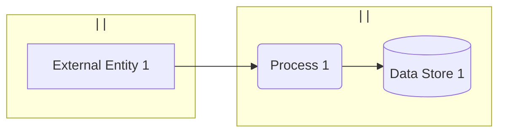
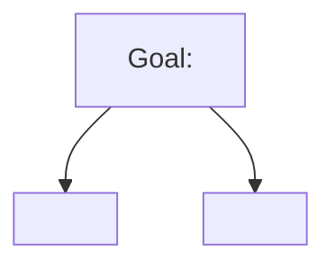

# Threat Model: <System Name>

**Version**: 0.1
**Date**: <YYYY-MM-DD>
**Author(s)**:
**Reviewer(s)**:
**Status**: Draft / Reviewed / Approved
**Next review trigger**: <e.g. "next architectural change", "before v2.0 release", "annual">

> This template is laid out as a **hybrid threat model** — the skill's default output, never a single-method document. Section 2 is split into three strata (Contextual / Operational / Strategic). All threats share one ID space and one risk-rating scale so Section 3 can prioritize across strata. The amount of content per stratum scales with the system's stakes; the *presence* of all three strata does not. Drop a stratum only deliberately, with a one-line "not applicable: <reason>".
>
> Read `references/methodologies.md` § "Hybrid as default" before filling this out — the system-type matrix tells you which contextual supplements and which strategic references to add.

---

## 1. What are we working on?

### System description

<1–2 paragraphs. What does it do, who uses it, where does it run.>

### Scope

**In scope**:
-

**Out of scope**:
-

### Assets

> Use `AS` prefix for assets to keep them distinct from asset-centric *findings* (`A`-prefixed) in §2.1.b.

| ID | Asset | Description | Why it matters |
|----|-------|-------------|----------------|
| AS1 |      |             |                |

### Trust levels

| ID | Trust level | Description |
|----|-------------|-------------|
| TL1 | Anonymous external | |
| TL2 | Authenticated user | |
| TL3 | Privileged user / admin | |
| TL4 | Service / machine identity | |

### Assumptions

1.
2.
3.

### Technology stack and environment

> Fill this in before drawing the DFD. See `references/environments.md` for the per-environment trust-boundary patterns this drives, and SKILL.md § "Round 1.5" for what to capture. If any field is unclear, record an assumption above and proceed.

- **Protocols on each flow**: <e.g. DICOM C-STORE over TCP/11112; HL7 v2 over MLLP; HTTPS/REST with OAuth2; Modbus/TCP; MQTT over TLS; BLE GATT>
- **Runtimes / hosts per process**: <e.g. PACS on RHEL 9 / Java 17; ingestion service on AWS Lambda / Python 3.12; embedded firmware on Cortex-M33 / FreeRTOS>
- **Identity / secrets**: <e.g. Okta SSO + AWS IAM; AD-integrated; device certificate from internal CA stored in secure element>
- **Environment types in scope** (from `environments.md` taxonomy): <cloud (AWS) / on-prem enterprise (Hospital IT, AD-integrated) / embedded (medical device on Cortex-M33) / OT/ICS (Purdue L1–L3) / mobile (iOS app) / hybrid>
- **Ownership per zone**: <list — who owns each environment in the DFD; e.g. "Vendor owns the cloud account; Customer IT owns the on-prem network; End-user owns the mobile device; Apple owns the iOS keystore">
- **Physical / operational context**: <e.g. device deployed in clinical room with limited physical access; debug ports fused; OTA updates over HTTPS with image signing>

### Data Flow Diagram

> Subgraph label convention: `subgraph ID["<owner> | <env-type> | <trust>"]` — see `references/dfd-mermaid.md` § "Subgraph labeling convention". The per-environment boundary patterns in `references/environments.md` should drive *which* subgraphs you draw.

### Trust boundaries

| Boundary | Owner (left) | Owner (right) | What crosses | Mediating control |
|---|---|---|---|---|
| ZoneA ↔ ZoneB | | | | |

### Data of interest (fill in if a data-centric pass is in §2.1)

> Use only if §2.1.b includes a data-centric pass. See `references/data-centric.md` for workflow.

- **Data class**: <e.g. PHI / DICOM study; signing key; refresh token>
- **Custodian**:
- **Security objectives in scope**: C / I / A — justify each drop
- **Authorized locations** (storage / transmission / execution / input / output): list with `L1`, `L2`, ... — reference the corresponding DFD elements where they exist; mark lifecycle-only locations explicitly

### Losses, hazards, constraints (fill in if STPA-SafeSec is the contextual core in §2.1)

> Use only if §2.1 swaps in STPA-SafeSec for safety-critical control-loop systems. See `references/stpa-safesec.md` for the full workflow.

- **Losses** (`L-1` …): unacceptable stakeholder outcomes (patient harm, equipment destruction, environmental damage)
- **Hazards** (`H-1 [L-x]` …): system states that, in worst case, lead to a loss
- **Constraints** (`CSTR-S-1 [H-x]` …): system SHALL prevent / limit / detect each hazard condition
- **Control layer** (Mermaid `flowchart TD` — controllers `CTRL-N-x`, controlled processes, control actions `CTRL-C-x` as solid arrows down, feedback as dashed arrows up)
- **Component layer** (concrete nodes `CPT-N-x`, concrete connections `CPT-C-x`; wired vs wireless, end-to-end vs IP-routed)

---

## 2. What can go wrong?

### 2.1 Contextual stratum (system-specific)

> If STPA-SafeSec is the contextual core (safety-critical control-loop systems), §2.1.a (flow-centric STRIDE-Per-Element) and §2.1.b (supplementary entry-point pass) are replaced by the STPA-SafeSec workflow — UCAs (`HC-N`), system flaws (`F-N`), hazard-scenario trees, and integrity/availability constraints (`CSTR-I-N`, `CSTR-A-N`). STRIDE may still layer in for non-control flows (telemetry, OTA, audit) at the component layer. Workflow: `references/stpa-safesec.md`.

#### 2.1.a Flow-centric STRIDE-Per-Element (always)

| ID | Element | STRIDE | Threat | Likelihood | Impact | Risk |
|----|---------|--------|--------|------------|--------|------|
| T1 |         |        |        |            |        |      |
| T2 |         |        |        |            |        |      |

#### 2.1.b Supplementary entry-point pass (always — at least one)

> Pick from the system-type matrix in `references/methodologies.md`. Most common: data-centric (PHI / signing keys / tokens), asset-centric (crown jewels), user-needs-centric (rich business logic), process-centric (ops-heavy), code-centric (validation, if code is available).

**Pass type**: <data-centric / asset-centric / user-needs-centric / process-centric / code-centric>

| ID | Location / Asset / Need / Process | Category | Threat / Vector | Likelihood | Impact | Risk |
|----|-----------------------------------|----------|-----------------|------------|--------|------|
| V1 |                                   |          |                 |            |        |      |
| V2 |                                   |          |                 |            |        |      |

> Cross-reference to flow-centric IDs where the same finding surfaced there: `V3 ↔ T7` (don't duplicate; cross-reference).

#### 2.1.c Privacy / AI-specific pass (if applicable)

> Add if PII/PHI is in scope (LINDDUN — Linking / Identifying / Non-repudiation / Detecting / Data disclosure / Unawareness / Non-compliance) or if ML components are present (prompt injection, model extraction, training-data poisoning, adversarial examples — see OWASP LLM Top 10 / OWASP ML Security Top 10). Use `PR` prefix to keep these IDs distinct from DFD process labels (`P1`, `P2` …).

| ID | Element / Data | Category | Threat | Likelihood | Impact | Risk |
|----|----------------|----------|--------|------------|--------|------|
| PR1 |               |          |        |            |        |      |

#### 2.1.d Threat tree(s) for top 1–2 highest-value threats (optional)

> For STPA-SafeSec analyses, this same `flowchart TD` scaffold holds the hazard-scenario trees (one per system flaw, refined to the level where mitigation can be designed). Format: `references/stpa-safesec.md` § Q2.

### 2.2 Operational / Tactical stratum (generic adversary techniques + design-time chain)

> Always include the **STRIDE → CAPEC → CWE → mitigation chain** for at least the top threats. CAPEC's payoff over ATT&CK at design time is the CAPEC → CWE bridge: each pattern names the weakness class, which gives the mitigation in §3 a traceable target. Pick CAPEC abstraction level by SDLC stage (Meta = early architecture, Standard = design review, Detailed = component-level — see `references/capec.md`). For domain-specific protocols where no Detailed pattern exists (DICOM, HL7, ICS protocols), cite the closest Standard or Meta pattern and **say so explicitly** in the row. Also include ATT&CK technique IDs on top threats; add kill-chain sequencing where it clarifies handoff to SOC / IR.

| Threat ID | STRIDE | CAPEC (level) | CWE(s) | ATT&CK | Kill chain | CVE / CVSS | Detection / handoff notes |
|-----------|--------|---------------|--------|--------|------------|------------|---------------------------|
| T1 / V1 (example) | S | CAPEC-151 (Standard) — Identity Spoofing; child CAPEC-21 | CWE-287, CWE-290 | T1078 (Valid Accounts) | Exploitation | — | mTLS + AE-Title-pinned cert; SOC: alert on AE Title cert mismatch |
| (example, no Detailed) | T | CAPEC-272 (Meta) — Protocol Manipulation; *no DICOM-specific Detailed pattern exists; closest abstract match* | CWE-345 | T1565 (Data Manipulation) | Action on Objectives | — | Wire-level integrity check; pcap-based detection |
|           |        |               |        |        |            |            |                           |

### 2.3 Strategic stratum (sector landscape)

> Always include — even one paragraph. If genuinely nothing to add, write: *"Strategic: not applicable; <reason>."*

- **Sector ISAC / threat-intel context**: <H-ISAC for medical, FS-ISAC for finance, E-ISAC for energy, MS-ISAC for state/local gov, CISA ICS-CERT for ICS — list relevant advisories>
- **Regulatory framing**: <FDA premarket cybersecurity, IEC 62443, IEC 81001-5-1, HIPAA, GDPR, PCI, EU AI Act, NIST AI RMF — whichever apply>
- **Named-adversary context** (only if applicable): <e.g. ransomware groups targeting healthcare, ICS-targeted state actors — cite the source>
- **Business-impact framing** (PASTA-borrowed, only if executive sign-off is required): <link threats to revenue / regulatory fine exposure / reputational scenarios>

---

## 3. What are we going to do about it?

### Mitigation table — single prioritized list across all strata

| Threat ID(s) | Cross-refs (CAPEC / CWE / ATT&CK / sector) | Risk | Response | Control / mitigation | Owner |
|--------------|-------------------------------------------|------|----------|----------------------|-------|
| T1           | CAPEC-151, CWE-287, ATT&CK T1078 | High | Mitigate |                      |       |
| T2           |                                  | Medium | Accept | (rationale)          |       |

### Derived security requirements

> Cite the CWE the requirement closes — that's what makes the requirement traceable to a known weakness class rather than to a free-text threat sentence. The CAPEC → CWE step in §2.2 supplies the CWE ID.

- **SR-001**: The system SHALL <testable requirement>.
  Mitigates: T1, T3, V2 — closes CWE-287, CWE-290.
- **SR-002**: The system SHALL <testable requirement>.
  Mitigates: V1 — closes CWE-89.

---

## 4. Did we do a good enough job?

### Self-assessment checklist

**Diagram / setup**
- [ ] DFD reflects the system as actually built / specified
- [ ] Technology stack and environment section is filled in (protocols on each flow, runtimes, identity/secrets, environment types, owners, physical/operational context)
- [ ] Every subgraph carries an owner | env-type | trust label (`references/dfd-mermaid.md` § "Subgraph labeling convention"); ownership is also reflected in the trust-boundary table
- [ ] Per-environment boundary patterns from `references/environments.md` checked for the in-scope environment types (cloud / on-prem / embedded / OT/ICS / mobile)
- [ ] Flows are labeled with concrete protocols and authentication ("DICOM C-STORE over TCP/11112" / "HTTPS + mTLS"), not generic terms like "data"
- [ ] If a data-centric pass is included, "Data of interest" is filled in (data class, security objectives in scope with drop justifications, authorized locations)
- [ ] Assumptions are listed and falsifiable
- [ ] Out-of-scope items are explicit

**Contextual stratum (§2.1)**
- [ ] All elements analyzed for applicable STRIDE categories
- [ ] At least one supplementary entry-point pass run (per the system-type matrix)
- [ ] LINDDUN pass run if PII/PHI is in scope
- [ ] AI/ML-specific threats considered if ML components are present

**Operational stratum (§2.2)**
- [ ] At least the top 3 threats carry the full **STRIDE → CAPEC → CWE → mitigation** chain (CAPEC pattern with explicit abstraction level, the CWE(s) it exploits, and the mitigation class)
- [ ] At least the top 3 threats mapped to ATT&CK technique IDs
- [ ] Where no Detailed CAPEC pattern exists for a domain-specific protocol (DICOM, HL7, ICS), the closest Standard or Meta pattern is cited *and the row says so explicitly*
- [ ] Kill-chain / CVSS added where they aid handoff

**Strategic stratum (§2.3)**
- [ ] Sector ISAC / threat-intel context noted (or explicitly marked "not applicable: <reason>")
- [ ] Regulatory framing captured
- [ ] Named-adversary context included if the sector has one

**Cross-stratum**
- [ ] Threats are cross-referenced across strata, not duplicated
- [ ] All threats share one ID space and one risk-rating scale
- [ ] Every threat has a response decision in §3
- [ ] Every "Mitigate" decision has a concrete, testable control
- [ ] Top risks have an owner identified

**STPA-SafeSec (if it is the contextual core in §2.1)**
- [ ] Every loss has at least one hazard; every hazard has at least one constraint
- [ ] Every UCA traces to at least one system flaw
- [ ] Every system flaw has a root hazard scenario refined to where mitigation can be designed
- [ ] Every leaf-to-root path in each hazard-scenario tree is mitigated, OR the residual loss has been explicitly accepted via prioritization
- [ ] Adversarial causal factors (`CSTR-I-1..8`, `CSTR-A-1..4`) considered for every relevant constraint
- [ ] Component layer reflects current/planned reality, not a sanitized version

**Review**
- [ ] Stakeholders beyond the threat modeler have reviewed (note who below)

### Reviewers

-

### Open questions / to validate

-

### Changelog

| Version | Date | Author | Changes |
|---------|------|--------|---------|
| 0.1     |      |        | Initial draft |
