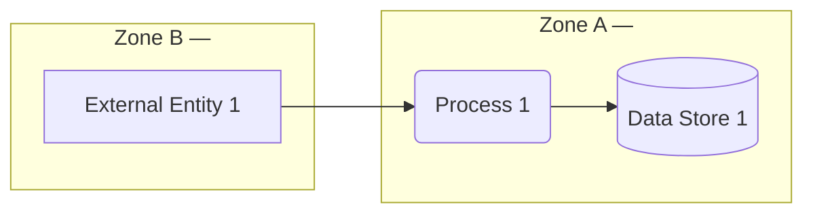
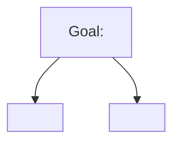

# Threat Model: <System Name>

**Version**: 0.1
**Date**: <YYYY-MM-DD>
**Author(s)**:
**Reviewer(s)**:
**Status**: Draft / Reviewed / Approved
**Next review trigger**: <e.g. "next architectural change", "before v2.0 release", "annual">

---

## 1. What are we working on?

### System description

<1–2 paragraphs. What does it do, who uses it, where does it run.>

### Scope

**In scope**:
-

**Out of scope**:
-

### Assets

| ID | Asset | Description | Why it matters |
|----|-------|-------------|----------------|
| A1 |       |             |                |

### Trust levels

| ID | Trust level | Description |
|----|-------------|-------------|
| TL1 | Anonymous external | |
| TL2 | Authenticated user | |
| TL3 | Privileged user / admin | |
| TL4 | Service / machine identity | |

### Assumptions

1.
2.
3.

### Data Flow Diagram

### Trust boundaries

- **ZoneA ↔ ZoneB**: <what crosses, what mediates>

---

## 2. What can go wrong?

### Threat enumeration (STRIDE-Per-Element)

| ID | Element | STRIDE | Threat | Likelihood | Impact | Risk |
|----|---------|--------|--------|------------|--------|------|
| T1 |         |        |        |            |        |      |
| T2 |         |        |        |            |        |      |

### Threat trees (optional, for top risks)

---

## 3. What are we going to do about it?

### Mitigation table

| Threat ID | Response | Control / mitigation | Owner |
|-----------|----------|----------------------|-------|
| T1        | Mitigate |                      |       |
| T2        | Accept   | (rationale)          |       |

### Derived security requirements

- **SR-001**: The system SHALL <testable requirement>.
  Mitigates: T1, T3
- **SR-002**: The system SHALL <testable requirement>.
  Mitigates: T2

---

## 4. Did we do a good enough job?

### Self-assessment checklist

- [ ] DFD reflects the system as actually built / specified
- [ ] All elements analyzed for applicable STRIDE categories
- [ ] Every threat has a response decision
- [ ] Every "Mitigate" decision has a concrete, testable control
- [ ] Top risks have an owner identified
- [ ] Assumptions are listed and falsifiable
- [ ] Out-of-scope items are explicit
- [ ] Stakeholders beyond the threat modeler have reviewed (note who below)

### Reviewers

-

### Open questions / to validate

-

### Changelog

| Version | Date | Author | Changes |
|---------|------|--------|---------|
| 0.1     |      |        | Initial draft |
