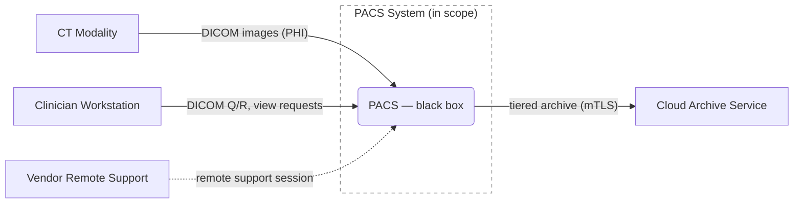
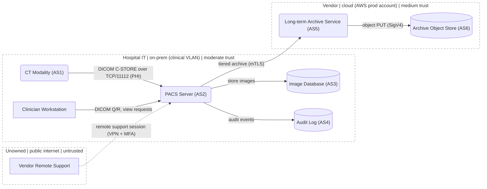
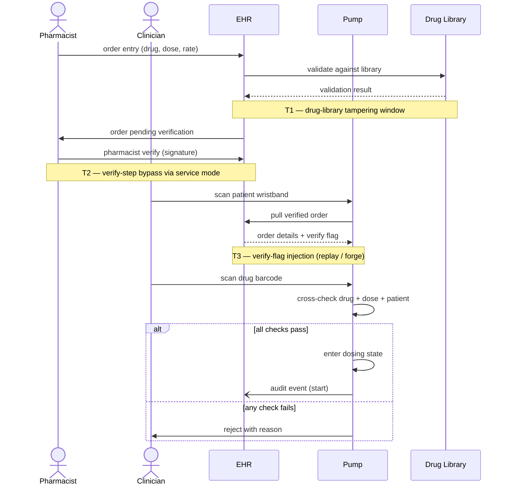
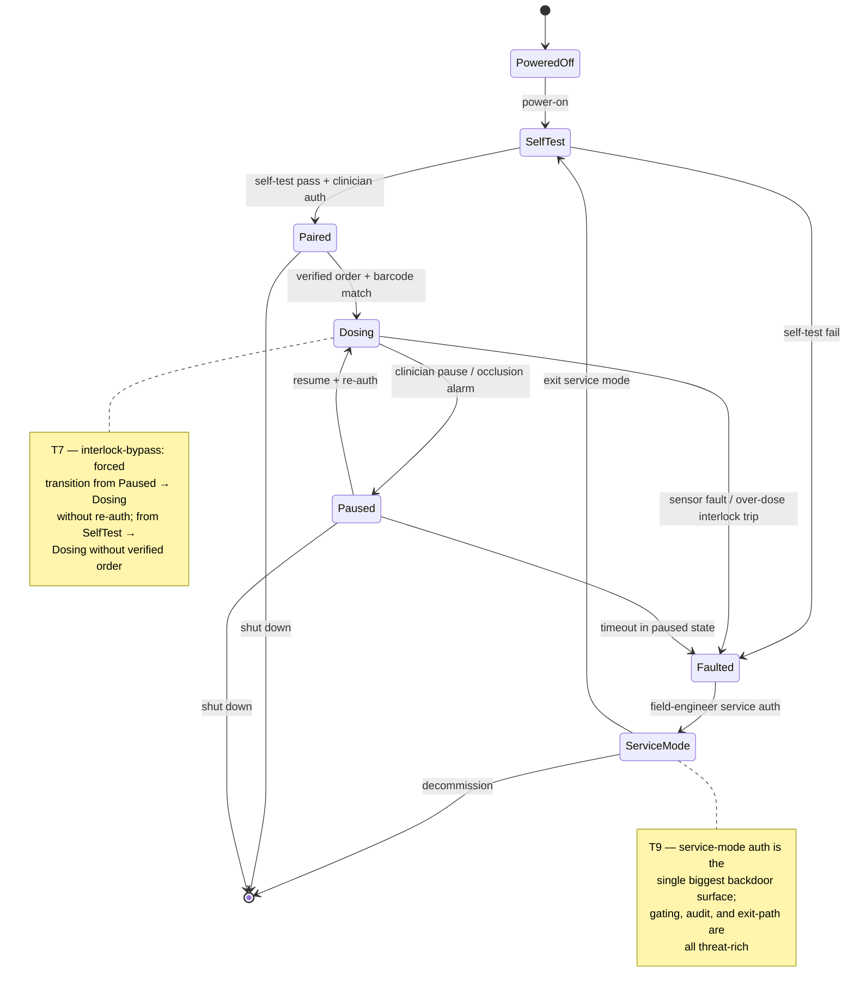

# Medical-device worked examples

> **Last verified**: 2026-05. Mermaid syntax (`flowchart`, `sequenceDiagram`, `stateDiagram-v2`) and the DICOM/HL7 protocol details re-confirm against upstream before relying on a specific edition.
> **Sources paraphrased**: Adam Shostack, *Threat Modeling: Designing for Security* (Wiley, 2014) — DFD3 conventions, STRIDE-Per-Element framing; NIST SP 800-154 (Draft, 2016, US public domain) — data-centric workflow; MITRE Threat Modeling Playbook (Toreon, OWASP) — sequence / state diagrams; DICOM Standard (NEMA); HL7 v2 / FHIR (HL7 International); Mermaid (mermaid-js.github.io, MIT).

> **Related**: ← `industries/medical/README.md` • `domain-notes.md` (intake template, layer mix, clinical workflow misuse) • `dicom-hl7.md` (DICOM/HL7 STRIDE specifics) • `risk-rating.md` (ISO 14971 / TIR57 mapping). Generic methodology these examples illustrate: `references/dfd-mermaid.md`, `references/data-centric.md`, `references/non-dfd-models.md`, `references/stride-prompts.md`, `references/methodologies.md`.

This file collects the medical-device worked examples that illustrate the skill's generic methodology against a concrete clinical system — a small PACS handling DICOM studies, and a smart infusion pump. The methodology itself is industry-agnostic and lives in `references/`; this file shows it applied. Read it alongside the generic reference for each technique.

All examples below center on the **same small PACS**: a CT modality acquires images and sends them via DICOM C-STORE to a PACS server, which stores studies in an image database, replicates nightly to an object-store backup, and serves them to clinician workstations on request. The infusion-pump examples (sequence and state diagrams) center on a smart infusion pump on the same clinical network.

## Worked example — small clinical PACS DFD

The same PACS, drawn at two levels of decomposition. Read them as a progression: Figure 1 (Level 0) is the context diagram a reviewer sees first; Figure 2 (Level 1) is the decomposition into the zones and components that STRIDE actually walks. Generic DFD-to-Mermaid conventions: `references/dfd-mermaid.md`.

### Figure 1 — Level 0 (context)

The Level 0 view says exactly four things and no more: what's in scope (one box), who talks to it (four external entities), what crosses (the labeled flows), and where the trust boundary sits (the dashed shape). The internal stores, the audit log, and the archive object store are *not* drawn at Level 0 — they're not visible from the outside. Level 0 is what a reviewer points at when asking "what is this system, and what touches it?"; everything else is decomposition.

### Figure 2 — Level 1 (decomposed)

Note four things this example demonstrates:

- **Every element is inside exactly one zone.** Vendor isn't floating; it's in an explicit `Untrusted` subgraph for the public internet.
- **Boundaries are dashed.** The `classDef tb` + `class … tb` pattern applies the dashed border to all three zone subgraphs at once.
- **The flow from `untrusted` is dashed too.** `Vendor -. "..." .-> PACS` uses Mermaid's dashed-arrow syntax to mark the highest-attention crossing; the in-zone flows stay solid.
- **Data-bearing elements carry inline `(AS#)` tags** — `(AS1)`..`(AS6)` — that reconcile against the §1 asset list of the threat model containing this DFD. External entities (Workstation, Vendor) aren't assets, so they have no tag.

What changes between Figure 1 and Figure 2: the single in-scope `PACS` box opens into the PACS server plus its Image Database and Audit Log, and ownership-typed trust zones (Hospital IT / Internet / Cloud) replace the single in-scope shape. The four external flows are preserved across both levels — that's the consistency check between Level 0 and Level 1 (no flow appears at Level 1 that wasn't already implied at Level 0; if one does, it's a missing external entity at Level 0 or an in-scope process leaking outside its stated boundary).

Trust boundaries (the dashed subgraph borders above):

- `Hospital` ↔ `Internet` — vendor support is the riskiest crossing.
- `Hospital` ↔ `Cloud` — egress over TLS to cloud archive.
- Within `Hospital`, modality ↔ PACS may itself be a soft boundary if the imaging VLAN is separated; call this out in prose.

### Trust boundary prose for this example

| Boundary | Owner (left) | Owner (right) | What crosses | Mediating control |
|---|---|---|---|---|
| Hospital ↔ Internet | Hospital IT | Unowned (public internet) | Vendor support sessions only | VPN concentrator + MFA |
| Hospital ↔ Cloud | Hospital IT | Vendor (AWS prod account) | Tiered archive PUTs (outbound only) | mTLS + cert pinning; no inbound |
| Imaging VLAN ↔ Clinical VLAN (within Hospital) | Hospital IT (imaging team) | Hospital IT (clinical team) | Modality → PACS only | L3 firewall ACLs; soft boundary |

The Owner columns are what make §3 of the threat model assignable — without ownership, "implement mTLS" has no addressee.

## Worked example — per-element STRIDE threats (PACS)

These illustrate the threat-table cell format from `SKILL.md` § "Threat enumeration" — a ≤6-word title, a colon, then a 1–2 sentence concrete description. They are seeds, not a checklist. Generic per-element category prompts: `references/stride-prompts.md` § "Category prompts".

### External entity (e.g. Clinician using PACS workstation)

- **S** — **Clinician credential phishing**: An attacker phishes a clinician's credentials and authenticates to the workstation as them.
- **R** — **Denied PHI export**: A clinician performs an unauthorized PHI export and later credibly denies it because no attributable log exists.

### Process (e.g. PACS server)

- **S** — **DICOM AE Title spoofing**: An attacker spoofs a trusted AE Title to deliver malicious imagery to the PACS server.
- **T** — **DICOM parser buffer overflow**: An attacker sends a crafted DICOM object that overflows a parser buffer and modifies process execution.
- **R** — **Audit log erasure**: An attacker with operational access erases server-local audit logs after tampering with stored images.
- **I** — **PHI leak via temp files**: An attacker reads PHI from temporary files the server writes during DICOM processing.
- **D** — **Connection-pool exhaustion**: An attacker opens crafted associations until the connection pool is exhausted and legitimate modalities can't connect.
- **E** — **Parser RCE to domain admin**: An attacker exploits a parser RCE to run as the PACS service account, then pivots to domain admin.

### Data flow (e.g. DICOM C-STORE between modality and PACS)

- **T** — **Pixel data tampering in transit**: An attacker on the segment modifies pixel data in transit because the flow has no TLS and no integrity check.
- **I** — **PHI capture in transit**: An attacker on the segment captures PHI from the unencrypted DICOM flow.
- **D** — **Segment flooding during a procedure**: An attacker floods the network segment to delay imaging while a procedure is underway.

### Data store (e.g. PACS image database)

- **T** — **Historical study modification**: An attacker with DB-write access modifies historical studies.
- **I** — **Study catalog exfiltration**: An attacker with DB-read access exfiltrates the study catalog.
- **D** — **Volume-fill halt**: An attacker fills the underlying storage volume so the database can't accept new acquisitions.
- **R** (audit log only) — **Audit row deletion**: An attacker deletes audit rows covering their access window.

## Worked example — data-centric pass on a DICOM study

This is the NIST SP 800-154 data-centric workflow applied to a single DICOM study. Generic data-centric workflow: `references/data-centric.md`.

System sketch: the same small PACS as the DFD above.

Flow-centric DFD elements: `EE1` (Modality), `EE2` (Clinician Workstation), `P1` (PACS Server), `DS1` (Image DB), `DS2` (Backup object store).

### Data of interest

A single DICOM study (PHI). Custodian: hospital. Lifecycle: acquisition → transit → storage → backup → render → optional export.

### Security objectives in scope

| Objective | In scope? | Rationale |
|-----------|-----------|-----------|
| Confidentiality | Yes | PHI under HIPAA |
| Integrity | Yes | Tampered pixel data could mislead diagnosis |
| Availability | No (deferred) | Owned by the flow-centric pass — DoS on PACS already covered there |

### Authorized locations

| ID | Location type | Concrete instance | DFD ref | Lifecycle-only? |
|----|---------------|-------------------|---------|-----------------|
| L1 | Storage     | PACS Image DB volume | DS1 | No |
| L2 | Storage     | Nightly backup to object store | DS2 | No |
| L3 | Transmission | DICOM C-STORE, Modality → PACS | EE1→P1 | No |
| L4 | Transmission | Render fetch, PACS → Workstation | P1→EE2 | No |
| L5 | Execution   | PACS process memory during render | (P1, runtime) | Yes — not on DFD |
| L6 | Output      | Debug log written during DICOM parse error | (P1, runtime) | Yes — not on DFD |
| L7 | Output      | Clinician export to USB | (EE2, runtime) | Yes — not on DFD |

### Vectors

| ID | Loc | Vector | CAPEC | CWE | AV | PR | AC | Impact |
|----|-----|--------|-------|-----|----|----|----|--------|
| V1 | L2 | **Over-permissive backup bucket ACL**: An attacker pulls the nightly backup from the object store because the bucket ACL grants read access too broadly. | CAPEC-180 (Exploiting Incorrectly Configured Access Control Security Levels) | CWE-732 | N | N | L | C |
| V2 | L3 | **Un-TLS'd DICOM segment MITM**: An on-network attacker intercepts the cleartext DICOM segment and modifies pixel data in transit. | CAPEC-94 (Adversary in the Middle) | CWE-319 | A | N | L | C, I |
| V3 | L5 | **PHI in core dumps**: A parser crash produces a core dump containing decrypted PHI, and core dumps are shipped to centralized telemetry. | CAPEC-150 (Collect Data from Common Resource Locations) | CWE-528 | N | L | L | C |
| V4 | L6 | **PHI in parse-error logs**: DICOM tags (PatientName, PatientID) are logged at parse-error level and forwarded to a SIEM the auditors hold no HIPAA BAA with. | CAPEC-150 (Collect Data from Common Resource Locations) | CWE-532 | N | L | L | C |
| V5 | L7 | **Unaudited USB study export**: A clinician exports a study to USB with no DLP enforcement and no audit trail at the workstation. | CAPEC-545 (Pull Data from System Resources) | CWE-200 | P | L | L | C, I |

### What flow-centric alone would have caught

V1 (DS2 information disclosure) and V2 (data flow tampering / information disclosure) are on the DFD and STRIDE-Per-Element would catch them. **V3, V4, V5 are not natural DFD elements** and would typically be missed by a flow-centric-only pass. That's the layering value.

### Controls (sketched)

- V1: enforce backup-bucket ACL via IaC; KMS-backed envelope encryption with separate key custodian; periodic restore-and-decrypt test.
- V2: require mTLS for all DICOM associations; pin AE Title to certificate.
- V3: disable core dumps in production; if required for support, redact via systemd-coredump filter; route to access-controlled debug bucket, not telemetry.
- V4: log redaction filter for DICOM PHI tags before any forwarder; or forward to SIEM under existing BAA.
- V5: workstation DLP policy; export requires re-authentication; export event logged to PACS audit store with chain-of-custody.

### Coverage check

- Every authorized location enumerated (storage / transmission / execution / input / output): yes (input is implicit at L3 for the modality side).
- Cross-location vectors considered: V3 (L5→external telemetry) and V4 (L6→external SIEM) are both authorized-location → unauthorized-recipient leaks. ✓
- Dropped objective (Availability) justified: yes — owned by flow-centric pass.
- Hybrid bridge: V1↔T(flow-centric backup-store-disclosure if present), V2↔T(flow-centric DICOM-flow tampering). Cross-reference rather than duplicate.

## Worked example — medication-administration sequence diagram

A clinical workflow where ordering matters — the pharmacist must verify *before* the clinician administers. Generic sequence/swim-lane guidance: `references/non-dfd-models.md` § "Sequence / swim-lane diagrams".

What this diagram makes visible that the DFD doesn't:

- **The verification step is ordered.** A DFD shows EHR ↔ Pump; the swim lane shows that the pharmacist's verification *must* precede the clinician's administration. An attacker who can administer without that verification flag wins — and the threat (T3 in the diagram) is "inject a forged verify flag," which a DFD alone can't even ask.
- **The threat-rich crossings are step-ordered.** T1 sits in the validation round-trip; T2 sits in the human-verification step (and is where service-mode-as-backdoor lives); T3 sits in the order-pull. Each `Note over` line in the diagram becomes a §2 threat row; the diagram and the threat table are co-registered.
- **The `alt` block is the safety gate.** "All checks pass → enter dosing" vs "any check fails → reject" is the interlock; in the DFD it's invisible. In the swim lane it's the single most-attacked branch.

## Worked example — smart infusion pump state machine

A device with named operational modes whose transitions gate safety checks. Generic state-diagram guidance: `references/non-dfd-models.md` § "State diagrams".

What this diagram makes visible that the DFD doesn't:

- **Authentication is gated on transitions, not on requests.** "Verified order + barcode match" is the *transition* into Dosing — an attacker who can drive that transition without the gate (force-set the state, replay an old transition message, exploit a self-test → dosing shortcut) bypasses the gate. The DFD can't show this; the state diagram is where the gates live.
- **Service mode is a state, not a flow.** A DFD shows "vendor remote support" as one external entity; the state diagram shows that ServiceMode is a *device state* with elevated privileges, an entry gate (auth), and an exit gate (return to SelfTest). Each gate is a threat-table row.
- **Fault → ServiceMode is the backdoor path.** This is the single most-overlooked threat in medical-device state machines: a forced fault gives the attacker a path to elevated privilege via the documented service workflow. STRIDE walks the transition; the diagram makes the transition visible.

### Sequence/state threats in the §2 table

Threats discovered in a sequence or state diagram live in the same §2 threat table as DFD-discovered threats — one ID space, same `AV / PR / AC + CIA` enums. The diagram of origin is recorded in the row's *Element* column or footnoted. These rows use the escalation table shape (safety-critical medical devices); a low-stakes system uses the eight-column minimum-viable shape — see `SKILL.md` § "Threat enumeration":

| ID | Element | STRIDE | Threat | CAPEC | CWE | … | AV | PR | AC | Impact |
|----|---------|--------|--------|-------|-----|---|----|----|----|--------|
| T7 | State `Dosing` (pump state machine) → H-2 | T | **Forced transition into Dosing**: An attacker forces a `SelfTest` → `Dosing` transition that bypasses the verified-order gate, starting an infusion that was never confirmed. | CAPEC-74 (Manipulating State) | CWE-372 | … | A | N | L | I, A |
| T9 | State `ServiceMode` (pump state machine) | E | **Service-mode credential abuse**: An attacker uses static or shared field-engineer credentials to enter service mode, the device's privilege-elevation path. | CAPEC-560 (Use of Known Domain Credentials) | CWE-798 | … | L | L | L | C, I, A |
| T3 | EHR → Pump message in step 5 (medication-administration sequence) → H-2 | T | **Forged pharmacist-verified flag**: An attacker injects or replays the order-pull message to forge a "pharmacist verified" claim the pump trusts. | CAPEC-272 (Protocol Manipulation) | CWE-345 | … | A | N | L | I |

This is what the Manifesto's "Multiple representations" pattern looks like operationally: three diagrams (DFD + sequence + state), one threat table, one prioritized §3 list.

## How the strata layer in this example

The PACS examples above span the contextual stratum: the flow-centric DFD (this file § "small clinical PACS DFD") and the data-centric pass (this file § "data-centric pass on a DICOM study") together show the contextual-stratum layering — flow-centric threats `T#` and data-centric vectors `V#` cross-referenced rather than duplicated. For the operational and strategic strata of the same system, the pattern is: ATT&CK technique IDs on the V1–V5 vectors and on the corresponding flow-centric threats; H-ISAC + FDA premarket cybersecurity + IEC 81001-5-1 references in a one-paragraph strategic section. The cross-stratum chain reads: *"V3 (data-centric) ≈ T7 (flow-centric); CAPEC-150 (Standard) → CWE-532; maps to ATT&CK T1119 (Automated Collection); within-sector precedent: H-ISAC advisory 2023-07."* Generic hybrid-layout framing: `references/methodologies.md` § "The hybrid layout".
