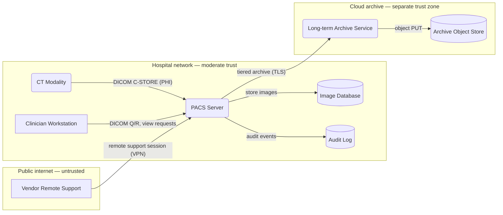

# DFD → Mermaid mapping

Mermaid renders well in GitHub, GitLab, Markdown editors, and Polarion (with the Mermaid plugin). It's the practical default for a text-first threat modeling workflow.

Mermaid doesn't natively render trust boundaries the way a dedicated threat modeling tool does, so we use `subgraph` blocks to group elements by trust zone and a prose key to explain the convention.

## Element mapping

| DFD element | Mermaid syntax | Notes |
|---|---|---|
| External entity | `EE[Label]` (square brackets, rectangle) | Distinct visual from processes |
| Process | `P1(Label)` (parens, rounded) or `P1((Label))` (double parens, circle) | Pick one and be consistent |
| Multi-process | `MP[[Label]]` (subroutine shape) | Use only when decomposition is shown elsewhere |
| Data store | `DS[(Label)]` (cylinder) | Standard cylinder shape |
| Data flow | `A -- "label" --> B` | Always label what flows |
| Trust boundary | `subgraph Zone["Zone name"]` ... `end` | Each subgraph is one trust zone |

Per-edge styling (optional, for emphasis on highest-risk flows):

```
linkStyle 0 stroke:#d62728,stroke-width:2px
```

## Worked example: small clinical PACS



Trust boundaries (the implicit "dotted lines"):

- `Hospital` ↔ `Internet` — vendor support is the riskiest crossing.
- `Hospital` ↔ `Cloud` — egress over TLS to cloud archive.
- Within `Hospital`, modality ↔ PACS may itself be a soft boundary if the imaging VLAN is separated; call this out in prose.

## Levels of decomposition

Don't pack everything into one diagram. Use a hierarchy:

- **Level 0 (context)** — the system as a black box plus all external entities and external data flows. One page, ~5–8 elements.
- **Level 1 (decomposed)** — the system's major internal processes and stores, with the same external entities. ~10–15 elements.
- **Level 2+ (focused)** — drill into one component when it warrants its own model (e.g. the DICOM parser, or the auth service). Reference back to the Level 1 element this expands.

If your diagram has more than ~15 elements or feels unreadable, you owe the reader a decomposition.

## Conventions to keep things readable

- **Label every flow.** "DICOM C-STORE (PHI)" not "data". The label is what makes the threat enumeration tractable.
- **Direction matters.** Use `-->` for one-way and `<-->` only when the flow truly is symmetric request/response with the same content. For RPC-style flows, draw two arrows with their actual content labels.
- **Group by trust zone, not by physical layout.** Trust zones are what STRIDE-Per-Element care about.
- **Color sparingly.** Use `style` only to highlight the riskiest crossings or the highest-risk elements. Don't decorate. (Note: ~1 in 12 people have some form of color blindness, so don't rely on color alone — always pair color with text labels.)
- **Stable element IDs.** Use short stable IDs (`P1`, `DS2`, `EE3`) so the threat table can reference them.

## Shostack's diagramming rules of thumb

These rules (paraphrased from *Threat Modeling: Designing for Security*, Ch. 1–2) are the single best test for whether a DFD is good enough to enumerate threats against. Apply them as you draw, and as a checklist at the end:

- **Focus on data flow, not control flow.** Threats follow data; control-flow diagrams hide where attackers can reach.
- **The "sometimes / also" test.** Anytime the team has to qualify a description with "sometimes we connect via TLS, but also fall back to HTTP" — that's two flows, not one. Draw both, and consider whether an attacker can force the fallback.
- **No data sinks.** Every piece of data written somewhere has a reader; show who reads it. If you can't name the reader, either the flow shouldn't exist or you've missed a process.
- **Data can't move itself between stores.** If the diagram shows a flow from one data store directly to another with no process in between, you've omitted the process that actually moves the data. Add it.
- **Tell a story.** The diagram should support the team telling a story about how the system works, end-to-end, while pointing at it. If telling that story requires editing the diagram or adding caveats, the diagram isn't done.
- **Don't draw an eye chart.** A diagram so dense you have to squint is no longer doing its job. Decompose.
- **Combine equivalent elements.** If two boxes are inside the same trust boundary, run on the same technology, and handle the same data — they're equivalent for threat modeling purposes. Combine them into one labeled element. (Don't lose information; do reduce clutter.)
- **The diagram is for thinking, not for showing off.** When considering whether to add detail or another sub-diagram, don't ask "is this the right way to do it?" Ask "does this help us think about what might go wrong?"

## Diagramming checklist

A short version of the Shostack-derived checklist for use at the end of the diagramming phase. Every box should be checkable before moving to threat enumeration:

- [ ] We can tell a story about the system without changing the diagram.
- [ ] We can tell that story without "sometimes" or "also."
- [ ] We can point at the diagram and identify exactly where the software makes a security decision.
- [ ] All trust boundaries are shown — every UID/account boundary, application role, and network interface.
- [ ] The diagram reflects current or planned reality, not an aspirational version.
- [ ] We can see where all data goes and who uses it.
- [ ] Every data store has the process(es) that read/write it shown — no orphan stores.

## Trust boundaries — what to include

Trust boundaries are anywhere principals with different privileges interact. Specific things that should always show as boundaries:

- Account / UID / SID boundaries (different OS users)
- Network interface boundaries (different segments, VLANs, VPCs)
- Different physical computers or hosts
- VM / container boundaries (especially when the host is shared)
- Organizational boundaries (your org ↔ vendor ↔ customer)
- Tenant boundaries in multi-tenant systems
- Anywhere you can argue for different privileges

A useful tactic when you can't find boundaries: ask *does everything in this system have the same level of privilege and access to everything else? Is everything the system communicates with inside that same boundary?* If both answers are yes, draw a single trust boundary around everything. If either is no, you've found a missing boundary or a missing element.

A note on terminology: "trust boundary" and "attack surface" are closely related — an attack surface is a trust boundary plus the direction an attacker would come from. Many people use the terms interchangeably. This skill prefers "trust boundary" because it's directionally neutral and threats can flow either way across one.

A common piece of advice is that "trust boundaries should only cross data flows." That's good advice for a fully-decomposed model. If a boundary appears to cross a data store, that often indicates the store has different tables/rows with different trust levels — break it into two stores or add a sub-diagram. If a boundary crosses a process, the process probably has internal privilege separation that should be drawn explicitly.

Threats cluster around trust boundaries — but not *only* there. Complex parsing (DICOM PDU decoders, image format parsers, deserializers, regex engines on attacker input) is also threat-rich, even inside a single trust zone. Don't constrain enumeration to boundary crossings alone.

## Trust boundary prose template

After the diagram, include a short prose section that names each boundary and what crosses it. Example:

> **Trust boundaries**
>
> - **Hospital ↔ Internet**: Only vendor support sessions cross this boundary. Mediated by VPN concentrator and require MFA.
> - **Hospital ↔ Cloud**: Outbound only, TLS 1.2+, mTLS via mutual cert pinning. No inbound from cloud to PACS.
> - **Imaging VLAN ↔ Clinical VLAN** (within Hospital): Soft boundary. Modalities can reach PACS but not the audit DB. Enforced at L3 firewall.

This section is what a reviewer actually reads when assessing whether the model is right. The diagram alone isn't enough.

## Anti-patterns to avoid in the diagram

- **Spaghetti**: too many flows, unreadable. Decompose.
- **Trust boundaries everywhere**: if every element is in its own subgraph, you've drawn a network diagram, not a threat model. Boundaries should be where *trust* changes.
- **Missing data stores**: people often draw the processes and forget the databases. Stores hold the data attackers want.
- **Aspirational**: drawing what the system *should* look like rather than what it *is*. Threat model the real system; if the real system needs to change, that's a finding.
