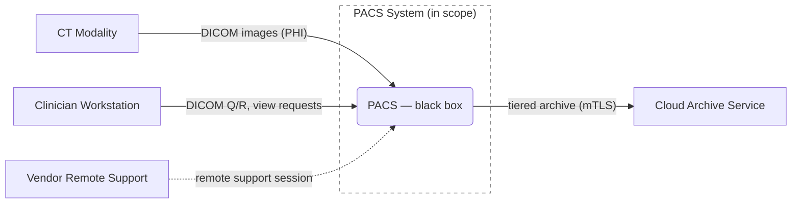
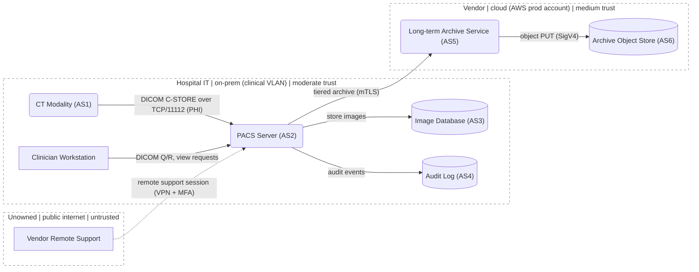
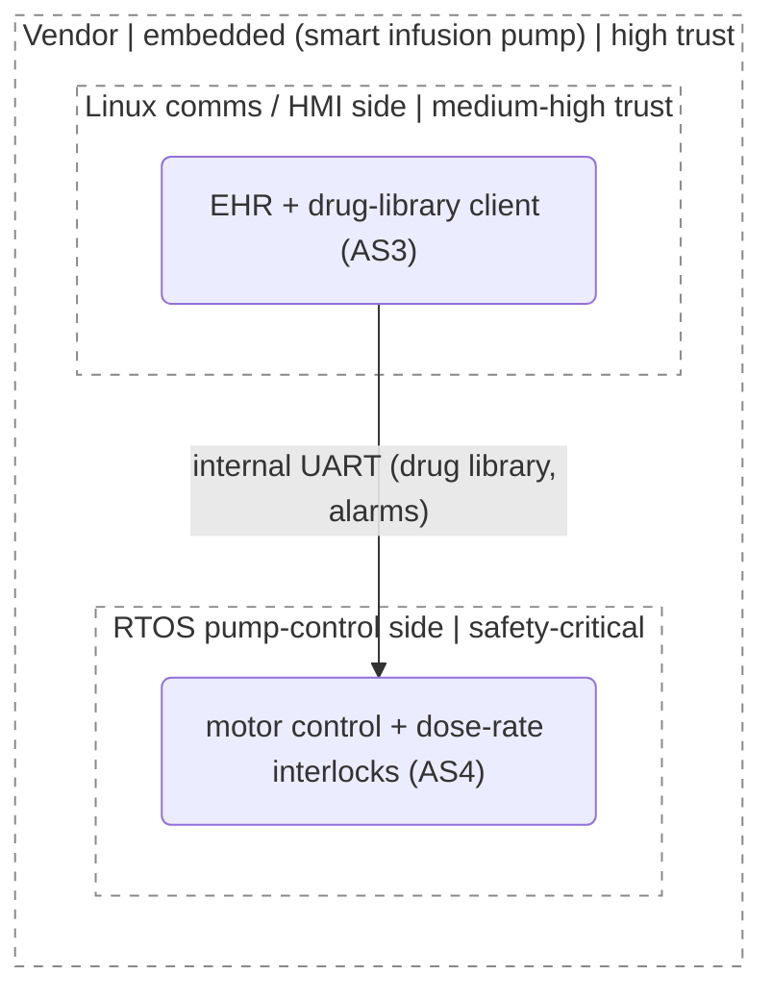

# DFD → Mermaid mapping

> **Last verified**: 2026-05. Mermaid syntax (especially `classDef` / `style` / `linkStyle` and the v10+ comma-escape rule) updates between Mermaid releases — re-verify against the live Mermaid docs if a deliverable target depends on a specific version.
> **Sources paraphrased**: Adam Shostack, *Threat Modeling: Designing for Security* (Wiley, 2014) — DFD3 dashed-trust-boundary convention, "focus on data flow" / "no data sinks" / "data can't move itself" / "tell a story" / "don't draw an eye chart" / "combine equivalent elements" rules-of-thumb, the diagramming checklist (paraphrase only). MITRE Threat Modeling Playbook (Toreon, OWASP) §2.3.1.1 — DFD3 conformance items (trust-boundary "complete shape" rule; data-flow arrow convention noted as a *deviation* below — see § "Conventions to keep things readable"). Mermaid syntax (mermaid-js.github.io, MIT licensed). Substantive direct quotes from Shostack 2014 require Wiley/Shostack attribution.

> **Related**: ← `SKILL.md` • `environments.md` (per-environment boundary patterns + ownership taxonomy) • `centric-methods.md` (flow-centric entry point) • `stride-prompts.md` (enumerate threats once the DFD is drawn) • `validation.md` (canonical diagramming checklist)

Mermaid renders well in GitHub, GitLab, Markdown editors, and Polarion (with the Mermaid plugin). It's the practical default for a text-first threat modeling workflow.

Mermaid doesn't natively render trust boundaries the way a dedicated threat modeling tool does, but solid `subgraph` borders read visually as *containment* (UML-package-style "this is part of that"), not as a *boundary an attacker crosses*. The default is to render every trust-boundary subgraph with a **dashed border** via the `classDef tb fill:none,stroke:#888,stroke-dasharray: 5 5` declaration plus a `class <SubgraphID>,<SubgraphID>,... tb` line that lists every trust-zone subgraph. This is the canonical pattern across this skill — use it on every diagram, the worked example (`references/dfd-mermaid.md` § "Worked example"), and the blank template (`assets/threat-model-template.md`). The per-subgraph `style ID fill:none,stroke:#888,stroke-dasharray: 5 5` form is acceptable only when there's a single subgraph; for two or more, use `classDef`. Pattern, examples, and the rare per-subgraph alternative are in § "Rendering trust boundaries as dashed subgraphs" below. Apply it to every diagram — it is not optional.

## Element mapping

| DFD element | Mermaid syntax | Notes |
|---|---|---|
| External entity | `EE[Label]` (square brackets, rectangle) | Distinct visual from processes |
| Process | `P1(Label)` (parens, rounded) or `P1((Label))` (double parens, circle) | Pick one and be consistent |
| Multi-process | `MP[[Label]]` (subroutine shape) | Use only when decomposition is shown elsewhere |
| Data store | `DS[(Label)]` (cylinder) | Standard cylinder shape |
| Data flow | `A -- "label" --> B` | Always label what flows |
| Trust boundary | `subgraph Zone["<owner> \| <env-type> \| <trust>"]` ... `end` + dashed-border styling | Each subgraph is one trust zone; nest subgraphs for sub-boundaries — see § "Subgraph labeling convention", § "Rendering trust boundaries as dashed subgraphs", and § "Nested subgraphs for sub-trust boundaries" |

Per-edge styling (optional, for emphasis on highest-risk flows):

```
linkStyle 0 stroke:#d62728,stroke-width:2px
```

## Worked example: small clinical PACS

The same PACS, drawn at two levels of decomposition. Read them as a progression: Figure 1 (Level 0) is the context diagram a reviewer sees first; Figure 2 (Level 1) is the decomposition into the zones and components that STRIDE actually walks.

### Figure 1 — Level 0 (context)



The Level 0 view says exactly four things and no more: what's in scope (one box), who talks to it (four external entities), what crosses (the labeled flows), and where the trust boundary sits (the dashed shape). The internal stores, the audit log, and the archive object store are *not* drawn at Level 0 — they're not visible from the outside. Level 0 is what a reviewer points at when asking "what is this system, and what touches it?"; everything else is decomposition.

### Figure 2 — Level 1 (decomposed)



Note four things this example demonstrates:

- **Every element is inside exactly one zone.** Vendor isn't floating; it's in an explicit `Untrusted` subgraph for the public internet.
- **Boundaries are dashed.** The `classDef tb` + `class … tb` pattern applies the dashed border to all three zone subgraphs at once.
- **The flow from `untrusted` is dashed too.** `Vendor -. "..." .-> PACS` uses Mermaid's dashed-arrow syntax to mark the highest-attention crossing; the in-zone flows stay solid.
- **Data-bearing elements carry inline `(AS#)` tags** — `(AS1)`..`(AS6)` — that reconcile against the §1 asset list of the threat model containing this DFD. External entities (Workstation, Vendor) aren't assets, so they have no tag.

What changes between Figure 1 and Figure 2: the single in-scope `PACS` box opens into the PACS server plus its Image Database and Audit Log, and ownership-typed trust zones (Hospital IT / Internet / Cloud) replace the single in-scope shape. The four external flows are preserved across both levels — that's the consistency check between Level 0 and Level 1 (no flow appears at Level 1 that wasn't already implied at Level 0; if one does, it's a missing external entity at Level 0 or an in-scope process leaking outside its stated boundary).

Trust boundaries (the dashed subgraph borders above):

- `Hospital` ↔ `Internet` — vendor support is the riskiest crossing.
- `Hospital` ↔ `Cloud` — egress over TLS to cloud archive.
- Within `Hospital`, modality ↔ PACS may itself be a soft boundary if the imaging VLAN is separated; call this out in prose.

## Levels of decomposition

Don't pack everything into one diagram. Use a hierarchy:

- **Level 0 (context)** — the system as a black box plus all external entities and external data flows. One page, ~5–8 elements.
- **Level 1 (decomposed)** — the system's major internal processes and stores, with the same external entities. ~10–15 elements.
- **Level 2+ (focused)** — drill into one component when it warrants its own model (e.g. the DICOM parser, or the auth service). Reference back to the Level 1 element this expands.

If your diagram has more than ~15 elements or feels unreadable, you owe the reader a decomposition.

## Subgraph labeling convention

Every subgraph (= one trust zone) is labeled with three pipe-delimited fields, in this fixed order:

```
subgraph ID["<owner> | <env-type> | <trust>"]
```

Where:

- **`<owner>`** — who owns the underlying network, host, account, or device (and therefore who can change configuration / patch / control access). Pick from the ownership taxonomy in `environments.md` § "Ownership taxonomy". When ownership is unclear, write `Unknown` and record an explicit assumption — don't guess silently. When two owners share a zone, write the one with operational control (e.g. `Customer IT (vendor service-account exception — ASM3)`).
- **`<env-type>`** — the environment kind from a fixed taxonomy, **without redundant prefixes**: `cloud (<provider>)`, `on-prem (<sub-zone, e.g. AD Tier 0 / corp VLAN / DMZ>)`, `embedded (<sub-zone, e.g. application core / secure element / baseband>)`, `Purdue L<n> (<named zone>)` for OT/ICS (don't write `OT/ICS (Purdue L2 — supervisory)` — `Purdue L2` already says it's OT and `L2` already says supervisory; just `Purdue L2 (supervisory)` or even `Purdue L2` once the model has established the cell is OT), `mobile (<sub-zone>)`, or `public internet`. Use the per-environment patterns in `environments.md` for sub-zones; collapsing a whole environment into one box loses most of the boundaries that matter.
- **`<trust>`** — qualitative trust level: `untrusted`, `low trust`, `medium trust`, `high trust`, `very high trust`, or domain-specific qualifiers like `safety-critical`, `out-of-scope owner`, `unknown`. Use the same scale across every diagram in one model so the prioritized §3 list is consistent.

**Compression rule.** When the same `<owner>` or `<env-type>` repeats across most of the subgraphs in one diagram (e.g. five OT zones all owned by "Hospital biomed"), state the common value once in a one-line key above the diagram and shorten the labels to just the distinguishing fields. Example:

```
Owners: Hospital biomed unless noted. Environment: OT/ICS Purdue levels.

subgraph L0["L0 (field) | safety-critical"]
subgraph L1_PLC["L1 PLC (interlocks) | very high trust"]
subgraph L1_RT["Vendor OEM | L1 (real-time control) | very high trust"]
subgraph L2_App["L2 (application) | medium-high trust"]
subgraph L2_Sup["Vendor OEM | L2 (supervisory) | high trust"]
```

Compression preserves all three pieces of information without making each label a 60-character sentence. Never compress a field that *isn't* repeated — owners that differ between zones (Vendor OEM vs Hospital biomed) are exactly the boundaries that matter; show them.

Examples (uncompressed, when the diagram has heterogeneous owners and environments):

```
subgraph HospNet["Hospital IT | on-prem (clinical VLAN) | moderate trust"]
subgraph DeviceSE["Vendor | embedded (secure element) | very high trust"]
subgraph SIS["Plant Operator | Purdue (Safety Instrumented System) | safety-critical, isolated"]
subgraph Keystore["OS Vendor (Apple/Google) | mobile (hardware-backed keystore) | very high trust"]
subgraph CSPCtrl["AWS | cloud (provider control plane) | out-of-scope owner"]
```

Why three fields and not one: a label like `Hospital network — moderate trust` (the older convention) tells the reader the trust level but hides the *owner* and the *environment kind* — both of which drive which mitigations are even possible. The three-field label makes responsibility-for-mitigation legible from the diagram, which is what §3 of the threat model needs to answer.

When a system spans multiple environments (almost always the case), every subgraph gets its own owner / env-type / trust triplet. Don't share labels across environments.

**Methodology framing belongs in §1 prose, not on labels.** A label is for identification (`Purdue L1 (PLC)`); the prose that explains *why* the diagram uses Purdue levels at all — "this cell is OT-shaped, so we segment per the Purdue Enterprise Reference Architecture" — belongs in the §1 system-description or environment paragraph. Same pattern for any other environment skeleton: AD Tier model on enterprise systems, Purdue on OT/ICS, the cloud account/VPC/subnet hierarchy on cloud, the iOS/Android sandbox model on mobile. Name the skeleton once in §1; let the labels carry just the level. Without this split, label space fills with redundant context (`OT/ICS (Purdue L2 — supervisory)` thrice) and the diagram gets noisier without telling the reader anything new.

A small follow-on: when two zones legitimately sit at the same Purdue level but are owned by different parties (e.g. a vendor's L1 real-time control system alongside the hospital biomed's L1 safety PLC), the diagram is *correct* — both are L1, that's the whole point — but readers used to a clean Purdue stack may second-guess it. A one-line note in §1 ("two L1 zones, distinguished by owner: Vendor OEM real-time control vs. hospital biomed PLC") prevents the misread.

## Rendering trust boundaries as dashed subgraphs

Mermaid renders `subgraph` borders as solid rectangles by default. Solid borders read visually as *containment* — UML-package-style "this object contains those objects." That's the wrong semantic for a threat model. A trust boundary is a *line an attacker crosses*, and Shostack's DFD3 convention (and every commercial threat-modeling tool) renders it dashed for exactly this reason.

The MITRE Threat Modeling Playbook §2.3.1.1 makes the same rule explicit: a trust boundary should be drawn as a **complete shape, not a line or arc**. The skill's `subgraph` + dashed-`classDef` pattern below realizes both conventions directly — every zone is a closed shape with a dashed outline, every element sits inside exactly one zone, and a flow that crosses the dashed border is visibly a trust crossing. This is the strongest single signal a reviewer has that the model uses DFD3 conventions correctly; it's not optional.

**Default to the `classDef` + `class` pattern below** for every diagram in this skill, including diagrams with only one subgraph (consistent with the worked example and the template). The per-subgraph `style` form is a fallback for tooling that doesn't render `classDef` correctly; mention it once if you fall back to it.

**Canonical pattern: `classDef` with `class` assignment.** Place these two lines at the bottom of the Mermaid block, listing every trust-zone subgraph in the `class` line:

```
classDef tb fill:none,stroke:#888,stroke-dasharray: 5 5
class HospNet,Internet,Cloud tb
```

**Fallback only: per-subgraph `style`.** Use only if `classDef` doesn't render in your target environment. One line per subgraph:

```
subgraph HospNet["Hospital IT | on-prem (clinical VLAN) | moderate trust"]
    PACS(PACS Server)
end
style HospNet fill:none,stroke:#888,stroke-dasharray: 5 5
```

`stroke-dasharray: 5 5` (5px dash, 5px gap) is the Shostack-DFD3-equivalent default. Other values (`3 3` for a tighter dash, `8 4` for a longer one) are fine — pick one per diagram. **`fill:none` matters**: without it, the subgraph fill obscures elements behind it when the renderer overlaps zones; `fill:none` makes the boundary a true outline.

**Comma-escape note for newer Mermaid (v10+):** when writing `stroke-dasharray` inside a `style` directive, some versions require the comma between dash and gap to be escaped — `stroke-dasharray: 5\,5` — because comma is a style-property delimiter. The space-separated form (`5 5`) sidesteps this and is supported across all Mermaid versions. Default to spaces.

Pair the dashed boundaries with these two visual conventions to keep the diagram legible:

- **Solid arrows for trusted/in-scope flows, dashed arrows for untrusted/external flows.** `A -- "label" --> B` vs `A -. "label" .-> B`. This way a reader can spot trust crossings at a glance: dashed-into-dashed-zone = the highest-attention edges.
- **Don't double-style.** A flow that's already crossing a dashed-border subgraph doesn't *also* need a dashed arrow. Reserve the dashed-arrow style for flows that cross from `untrusted` zones (public internet, attacker, untrusted external entity).

## Nested subgraphs for sub-trust boundaries

Real systems have trust boundaries inside trust boundaries. Mermaid supports nesting trivially — flat zones are a tooling habit, not a requirement.

When to nest:

- A device that runs two operating systems with a documented privilege boundary (a smart infusion pump's Linux comms / HMI side ↔ RTOS pump-control side; Android's normal world ↔ TrustZone secure world; an iOS app sandbox ↔ Secure Enclave).
- Cloud zones at multiple depths (account → VPC → subnet → security group; or account → VPC → cluster namespace).
- A Windows host that hosts a hypervisor (host OS ↔ guest VM ↔ container).
- An embedded device with a secure element distinct from the application processor.

Pattern:



The outer subgraph is the device as a unit (a physical box, an account); the inner subgraphs are the privilege zones inside it. The arrow between inner zones is the bridge — usually the highest-leverage place to put STRIDE attention.

**Don't nest gratuitously.** Two boxes inside the same trust zone running the same technology don't need a sub-zone — they're equivalent for STRIDE per Shostack's "combine equivalent elements" rule (§ Conventions below). Nest when there's a *real* privilege boundary between the inner zones, not just because they're labelled separately.

## Conventions to keep things readable

- **Label every flow.** "DICOM C-STORE over TCP/11112 (PHI)" not "data". Concrete protocols make threats tractable: an attacker can craft DICOM PDUs against an open `11112` listener, but they can't attack a flow labeled "data".
- **Direction matters.** Use `-->` for one-way and `<-->` only when the flow truly is symmetric request/response with the same content. For RPC-style flows, draw two arrows with their actual content labels.

  **Deviation from DFD3.** DFD3 (per the MITRE Threat Modeling Playbook §2.3.1.1, citing Shostack) defaults to a *double-headed* arrow because production traffic usually flows in both directions, with one filled / one open arrowhead reserved to signal which side initiates. **This skill deviates and defaults to one-way arrows** because the threats on each direction differ under STRIDE-Per-Element (a request flow and a response flow have different Spoofing / Tampering / Information-Disclosure surfaces), and collapsing them onto one bidirectional edge hides one of the two threat sets. Two one-way arrows with their actual content labels — request and response drawn separately — is what STRIDE-Per-Element wants. For genuinely symmetric flows (UDP heartbeats with identical content both ways, peer-to-peer gossip, mirrored replication), `<-->` is fine and matches DFD3. Document the deviation if you're claiming DFD3 conformance to a regulator; the choice is defensible but not silent.
- **Group by trust zone, not by physical layout.** Trust zones are what STRIDE-Per-Element care about.
- **Color sparingly.** Use `style` only to highlight the riskiest crossings or the highest-risk elements. Don't decorate. (Note: ~1 in 12 people have some form of color blindness, so don't rely on color alone — always pair color with text labels.)
- **Tag DFD elements with their §1 asset IDs.** Any element that represents a named asset from §1 (`AS1`, `AS2`, …) carries that ID inline in its label — `BeckIPC(("Beckhoff IPC<br/>application controller<br/>(AS3)"))` not just `BeckIPC(("Beckhoff IPC"))`. This makes the diagram self-checking against §1: a reviewer can scan the picture, count `AS#` tags, and confirm against the §1 asset list without flipping back and forth. Elements that aren't assets (the JVM as such, a transient process, an external entity) stay untagged. When one element carries multiple assets (a DB holding both PHI and signing keys), tag both: `(AS8, AS9)`. Trust boundaries themselves don't get asset IDs — boundaries are properties of the diagram, not assets.
- **Stable element IDs.** Use short stable IDs (`P1`, `DS2`, `EE3`) for the Mermaid node IDs so the threat table can reference them. Note these are different from the §1 asset IDs above; the Mermaid ID identifies the *box*, the `AS#` identifies the *thing the box stands for*.

## Shostack's diagramming rules of thumb

These rules (paraphrased from *Threat Modeling: Designing for Security*, Ch. 1–2) are the single best test for whether a DFD is good enough to enumerate threats against. Apply them as you draw, and as a checklist at the end:

- **Focus on data flow, not control flow.** Threats follow data; control-flow diagrams hide where attackers can reach.
- **The "sometimes / also" test.** Anytime the team has to qualify a description with "sometimes we connect via TLS, but also fall back to HTTP" — that's two flows, not one. Draw both, and consider whether an attacker can force the fallback.
- **No data sinks.** Every piece of data written somewhere has a reader; show who reads it. If you can't name the reader, either the flow shouldn't exist or you've missed a process. (Medical-device-specific violations to watch for: audit logs written but never read — PHI accumulating without lifecycle controls — and device-local telemetry stored on the device but never uploaded; both are PHI risks even though no exfiltration ever happens. See `medical.md` § "Clinical workflow misuse".)
- **Data can't move itself between stores.** If the diagram shows a flow from one data store directly to another with no process in between, you've omitted the process that actually moves the data. Add it.
- **Tell a story.** The diagram should support the team telling a story about how the system works, end-to-end, while pointing at it. If telling that story requires editing the diagram or adding caveats, the diagram isn't done.
- **Don't draw an eye chart.** A diagram so dense you have to squint is no longer doing its job. Decompose.
- **Combine equivalent elements.** If two boxes are inside the same trust boundary, run on the same technology, and handle the same data — they're equivalent for threat modeling purposes. Combine them into one labeled element. (Don't lose information; do reduce clutter.)
- **The diagram is for thinking, not for showing off.** When considering whether to add detail or another sub-diagram, don't ask "is this the right way to do it?" Ask "does this help us think about what might go wrong?"

## Diagramming checklist

The end-of-diagramming checklist (Shostack-derived) is the canonical version in `validation.md` § "Diagramming checklist". Use it at the end of the diagramming phase — every box should be checkable before moving to threat enumeration. Don't duplicate it here.

## Trust boundaries — what to include

Trust boundaries are anywhere principals with different privileges interact. The list below is the **floor** — boundaries that apply to every environment. Once you know the environment type (cloud / on-prem enterprise / embedded / OT/ICS / mobile), use `references/environments.md` for the per-environment patterns that catch boundaries this generic list misses (Purdue levels for OT, app sandbox / keystore for mobile, secure-boot / JTAG / secure element for embedded, account / VPC / IAM / KMS for cloud, AD tier model / SSO federation / jump-host for enterprise). Both lists; not just one.

Generic boundaries that should always show up:

- Account / UID / SID boundaries (different OS users)
- Network interface boundaries (different segments, VLANs, VPCs)
- Different physical computers or hosts
- VM / container boundaries (especially when the host is shared)
- Organizational boundaries (your org ↔ vendor ↔ customer)
- Tenant boundaries in multi-tenant systems
- Ownership boundaries — wherever the *owner* of the underlying network/host/account changes (vendor → customer, customer → cloud provider, end-user → OS vendor). The shared-responsibility model applies in every environment, not just cloud — see `environments.md` § "Ownership taxonomy".
- Anywhere you can argue for different privileges

A useful tactic when you can't find boundaries: ask *does everything in this system have the same level of privilege and access to everything else? Is everything the system communicates with inside that same boundary?* If both answers are yes, draw a single trust boundary around everything. If either is no, you've found a missing boundary or a missing element.

A note on terminology: "trust boundary" and "attack surface" are closely related — an attack surface is a trust boundary plus the direction an attacker would come from. Many people use the terms interchangeably. This skill prefers "trust boundary" because it's directionally neutral and threats can flow either way across one.

A common piece of advice is that "trust boundaries should only cross data flows." That's good advice for a fully-decomposed model. If a boundary appears to cross a data store, that often indicates the store has different tables/rows with different trust levels — break it into two stores or add a sub-diagram. If a boundary crosses a process, the process probably has internal privilege separation that should be drawn explicitly.

Threats cluster around trust boundaries — but not *only* there. Complex parsing (DICOM PDU decoders, image format parsers, deserializers, regex engines on attacker input) is also threat-rich, even inside a single trust zone. Don't constrain enumeration to boundary crossings alone.

## Trust boundary prose template

After the diagram, include a short prose section that names each boundary, what crosses it, **and who owns each side** — ownership tells §3 who can implement the mitigation. Use a table for clarity once you have more than two boundaries.

Example (table form):

| Boundary | Owner (left) | Owner (right) | What crosses | Mediating control |
|---|---|---|---|---|
| Hospital ↔ Internet | Hospital IT | Unowned (public internet) | Vendor support sessions only | VPN concentrator + MFA |
| Hospital ↔ Cloud | Hospital IT | Vendor (AWS prod account) | Tiered archive PUTs (outbound only) | mTLS + cert pinning; no inbound |
| Imaging VLAN ↔ Clinical VLAN (within Hospital) | Hospital IT (imaging team) | Hospital IT (clinical team) | Modality → PACS only | L3 firewall ACLs; soft boundary |

Or in prose form:

> **Trust boundaries**
>
> - **Hospital ↔ Internet** (owners: Hospital IT ↔ unowned). Only vendor support sessions cross this boundary. Mediated by VPN concentrator and require MFA. Mitigation responsibility: Hospital IT.
> - **Hospital ↔ Cloud** (owners: Hospital IT ↔ Vendor on AWS). Outbound only, TLS 1.2+, mTLS via mutual cert pinning. No inbound from cloud to PACS. Mitigation responsibility split: Vendor for cloud-side controls, Hospital IT for egress firewall.
> - **Imaging VLAN ↔ Clinical VLAN** (within Hospital, both Hospital IT-owned). Soft boundary. Modalities can reach PACS but not the audit DB. Enforced at L3 firewall.

This section is what a reviewer actually reads when assessing whether the model is right. The diagram alone isn't enough. The Owner columns are what make §3 of the threat model assignable — without ownership, "implement mTLS" has no addressee.

## Anti-patterns to avoid in the diagram

- **Spaghetti**: too many flows, unreadable. Decompose.
- **Trust boundaries everywhere**: if every element is in its own subgraph, you've drawn a network diagram, not a threat model. Boundaries should be where *trust* changes.
- **Missing data stores**: people often draw the processes and forget the databases. Stores hold the data attackers want.
- **Aspirational**: drawing what the system *should* look like rather than what it *is*. Threat model the real system; if the real system needs to change, that's a finding.

## Why flow-centric DFDs and not process-flow diagrams (PFDs)

ThreatModeler's process-flow diagram (PFD) framing argues that DFDs miss multi-step user-flow threats — situations where each individual step is fine but the sequence is exploitable (a TOCTOU between authorization and action; a verification step that can be bypassed by reaching the next step from a different entry; an approval workflow whose sequence an attacker can reorder). The critique is real, and a flow-centric DFD doesn't directly address it. The skill stays flow-centric anyway because data is what attackers ultimately want and trust boundaries are what they ultimately cross — both of which DFDs surface natively, and PFDs surface awkwardly. The compensating moves are (a) STRIDE-Per-Interaction on cross-boundary flows (`references/stride-prompts.md`), which forces the modeler to ask "what if this step happens before / after / without the previous one?", (b) attack trees on the top one or two business-logic flows (`references/methodologies.md` § "Attack trees"), which are the right shape for ordered-step exploitability, and (c) sequence / swim-lane diagrams (`references/non-dfd-models.md`) where the workflow is the threat surface. With those three supplements, the PFD critique is mostly absorbed; without them, it stings.

## Translating to other diagramming tools

If your org mandates Microsoft Threat Modeling Tool (TMT), OWASP Threat Dragon, or pytm output, the DFD3 conventions in this skill — dashed `subgraph` borders for trust boundaries, three-field zone labels (owner / env-type / trust), `(AS#)` asset tagging, dashed-arrow flows from untrusted zones — translate directly to those tools' default rendering. Only the syntax changes: TMT renders trust boundaries as dashed rectangles natively, Threat Dragon as dashed lines, pytm as a styled subgraph in its dot output. Generate the Mermaid first (it's the readable text artifact), then export to the mandated tool's format; the underlying model is the same.
