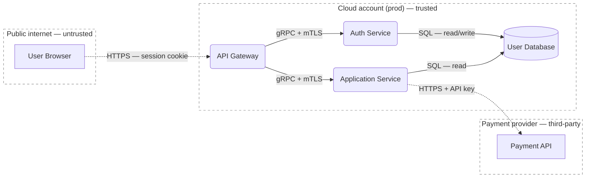
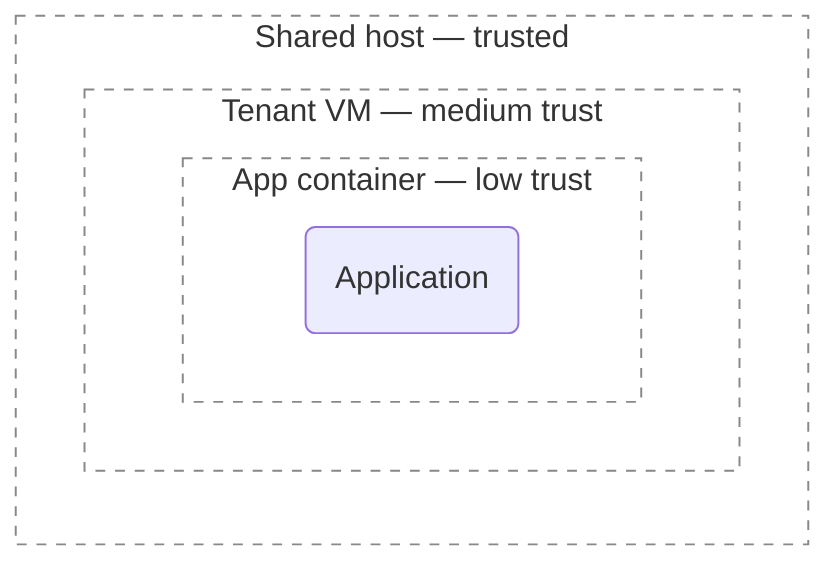

# Drawing the data-flow diagram

A DFD is the picture Q2 enumerates threats against. It shows how data moves through the system and where it crosses trust boundaries. Get it right and STRIDE almost writes itself; get it wrong and the threat enumeration inherits the gaps.

Mermaid is the practical default — it renders in GitHub, GitLab, and most Markdown tooling, and it's text, so it diffs and reviews like code.

## Element mapping

| DFD element | Mermaid syntax | Notes |
|---|---|---|
| External entity | `EE[Label]` (rectangle) | A person or system outside your control |
| Process | `P1(Label)` (rounded) | Something that *does* work; pick rounded or circle and stay consistent |
| Data store | `DS[(Label)]` (cylinder) | Databases, files, queues, caches, config |
| Data flow | `A -- "label" --> B` | Always label what flows, with protocol + auth |
| Trust boundary | `subgraph Zone[...]` ... `end` | One subgraph per trust zone |

Give each Mermaid node a short stable ID (`P1`, `DS2`, `EE3`) so the threat table can reference it.

## Worked example: a small web service



What this example shows:

- **Every element sits in exactly one zone.** The browser isn't floating — it's explicitly in an untrusted `Internet` zone. A floating element almost always means a missing boundary.
- **Flows are labelled with real protocols and auth.** "gRPC + mTLS" tells you the available controls; "data" tells you nothing.
- **Boundary crossings are visible.** The dashed arrows are the flows that cross from an untrusted zone — the highest-attention edges.

## Trust boundaries

A trust boundary is anywhere principals with different privilege interact. The generic list — applies to every system:

- Network segment boundaries (VLANs, subnets, VPCs)
- Process / account / UID boundaries
- VM and container boundaries, especially on shared hosts
- Organizational boundaries (your org ↔ vendor ↔ customer)
- Tenant boundaries in multi-tenant systems
- Privilege boundaries (user ↔ admin, unprivileged ↔ root)
- Physical boundaries (anywhere an attacker can touch hardware)

For boundaries specific to an environment type — cloud accounts/VPCs/IAM, AD tiers, OT Purdue levels, mobile sandboxes, embedded secure elements — see `environments.md`.

A quick test when you can't find any boundaries: *does everything in the system have the same privilege and access to everything else?* If yes, draw one boundary around the whole thing. If no, you've found a missing boundary or a missing element.

After the diagram, write a short trust-boundary table — each boundary, what crosses it, the control that mediates it. That table, more than the diagram, is what a reviewer reads to judge whether the model is right.

## Rendering trust boundaries clearly (recommended)

Mermaid's default solid `subgraph` border reads as *containment* ("this is part of that"), not as *a line an attacker crosses*. A dashed border reads better for a threat model — it matches the convention every dedicated threat-modeling tool uses. It's a recommendation, not a rule:

```
classDef tb fill:none,stroke:#888,stroke-dasharray:5 5
class Internet,Cloud,ThirdParty tb
```

`fill:none` keeps the boundary a true outline. A complementary convention: solid arrows for in-zone/trusted flows, dashed arrows (`A -. "..." .-> B`) for flows crossing from an untrusted zone, so trust crossings are visible at a glance.

## Labelling zones

A bare zone name ("Cloud") is fine for a simple system. For anything where mitigation ownership matters, it helps to note two more things on the zone: **who owns it** (who can change its configuration, run its patch cycle, control its access) and **how trusted it is**. A readable convention is a short suffixed label:

```
subgraph Cloud["Cloud account (prod) — owner: us — trusted"]
subgraph Vendor["Vendor SaaS — owner: third party — limited trust"]
```

Use whatever format reads cleanly; the point is that the diagram makes ownership and trust legible, because that is what Q3 needs to assign mitigations. Don't force a rigid template onto a diagram where it adds noise. The ownership taxonomy is in `environments.md`.

## Nested boundaries

Real systems have boundaries inside boundaries — Mermaid nests `subgraph`s trivially. Nest when there is a *real* privilege boundary between the inner zones:



Other common cases: cloud account → VPC → subnet; an embedded device's application core vs. its secure element; a mobile app sandbox vs. the OS keystore. Don't nest just because two boxes have different names — two boxes in the same trust zone running the same technology don't need a sub-zone.

## Levels of decomposition

Don't pack everything into one diagram. If a diagram exceeds ~15 elements or feels unreadable, decompose:

- **Level 0 (context)** — the system as a black box plus external entities and external flows.
- **Level 1 (decomposed)** — major internal processes and stores, with the same external entities.
- **Level 2+ (focused)** — drill into one component when it warrants its own model; reference the Level 1 element it expands.

Multiple imperfect diagrams beat one perfect unreadable one.

## Shostack's diagramming rules of thumb

These are the best quick test of whether a DFD is good enough to enumerate against (paraphrased from *Threat Modeling: Designing for Security*, Ch. 1–2):

- **Focus on data flow, not control flow.** Threats follow data.
- **The "sometimes / also" test.** If describing the system needs "sometimes we use TLS, but also fall back to HTTP" — that's two flows. Draw both, and ask whether an attacker can force the fallback.
- **No data sinks.** Every piece of data written somewhere has a reader; show who reads it.
- **Data can't move itself.** A flow from one store directly to another with no process between means you've omitted the process that moves it.
- **Tell a story.** The diagram should let the team narrate how the system works end-to-end while pointing at it, without editing it or adding caveats.
- **Combine equivalent elements.** Two boxes in the same trust boundary, on the same technology, handling the same data are equivalent for threat modeling — combine them.
- **Don't draw an eye chart.** A diagram too dense to read isn't doing its job. Decompose.
- **The diagram is for thinking, not showing off.** When deciding whether to add detail, ask "does this help us think about what might go wrong?" — not "is this the canonical way to draw it?"

## Diagram anti-patterns

- **Spaghetti** — too many flows, unreadable. Decompose.
- **Boundaries everywhere** — if every element is its own subgraph, you've drawn a network diagram, not a threat model. Boundaries go where *trust* changes.
- **Missing data stores** — people draw the processes and forget the databases. Stores hold what attackers want.
- **Aspirational** — drawing what the system *should* be, not what it *is*. Model the real system; if it needs to change, that's a finding.
