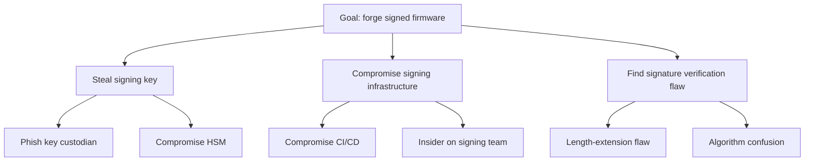

# Methodologies beyond STRIDE

This file covers **full-methodology swaps or supplements** — replacing the STRIDE *categorization lens* with something different (LINDDUN, PASTA, etc.) or adding an output characterization layer (ATT&CK, kill chains).

For the related but distinct question of "what's my **entry point** to enumerate threats?" — asset-centric, flow-centric, process-centric, user-needs-centric, code-centric, attacker-centric — see `centric-methods.md`. The two decisions are independent: you can pair flow-centric generation with STRIDE *or* with LINDDUN, and you can pair STRIDE with flow-centric *or* asset-centric entry. Don't conflate them.

STRIDE is the default categorization in this skill because it's the lingua franca: developers know it, OWASP teaches it, Microsoft tooling supports it, the Threat Modeling Manifesto authors use it. But it's not universal. This file is a quick-reference for when to swap or supplement.

## Decision flow

First decide whether you have a *categorization* problem or an *entry point* problem:

- "I'm not sure what to look at first" → entry-point problem → see `centric-methods.md`.
- "I'm not sure STRIDE is the right lens for what I'm enumerating" → categorization problem → use this file.

Then, for the categorization decision:

```
A specific data type dominates (PHI, signing key, token) — or regulatory framing
is data-typed (HIPAA / GDPR / PCI / FDA)?
  → Use data-centric (NIST SP 800-154) as the entry point — see centric-methods.md.
    STRIDE still works as the per-location lens.

Privacy is the dominant concern (PII/PHI/GDPR-heavy)?
  → Use LINDDUN alongside STRIDE. Often combine with data-centric entry point.

Need business-impact-driven scoring with executive buy-in?
  → Consider PASTA. Heavy process; budget for it.

High-value asset, want to reason adversarially about how it could be stolen/compromised,
and you can characterize the adversary?
  → Add an attack tree for that asset. (Generally avoid for medical-device work.)

Operational threat modeling (detection coverage, threat hunting, IR planning)?
  → MITRE ATT&CK + Cyber Kill Chain — but as a mapping layer over threats already generated.
    Not a substitute for design-time STRIDE.

Modeling at org/portfolio level, not per-system?
  → OCTAVE (process-heavy) or VAST (DevOps-friendly).

System has ML/AI components?
  → STRIDE + AI-specific threat list (prompt injection, model extraction, training-data poisoning, etc.).

Otherwise:
  → STRIDE-Per-Element.
```

## LINDDUN — privacy threat modeling

Privacy counterpart to STRIDE. Categories:
- **L**inking — data points can be tied to the same person.
- **I**dentifying — anonymous data can be re-identified.
- **N**on-repudiation (privacy sense) — a person can't deny an action they wished to make plausibly deniable.
- **D**etecting — an attacker can detect that a record exists / a person is in the dataset.
- **D**ata disclosure — unintended exposure.
- **U**nawareness — user doesn't know what's happening to their data.
- **N**on-compliance — violation of privacy policies / regulations.

When to use: GDPR-heavy systems, health data, location data, surveillance-adjacent systems, anything where "the data is sensitive even if it's not technically a security breach". Use *with* STRIDE, not instead — they cover different concerns.

Site: linddun.org

## PASTA — Process for Attack Simulation and Threat Analysis

Seven stages, business-driven:
1. Define business objectives.
2. Define technical scope.
3. Application decomposition.
4. Threat analysis (intel-driven).
5. Vulnerability and weakness analysis.
6. Attack modeling.
7. Risk and impact analysis.

When to use: regulated enterprise environments, executive-sponsored security programs, situations where threats need to be tied to business impact in dollars before anyone will act on them. Heavy: weeks to months for a real PASTA exercise.

Trade-off: thorough but slow. Don't pick PASTA for a sprint-level review.

## Attack trees

A tree where the root is an attacker goal ("steal the firmware signing key", "fraudulently issue a refund", "modify a CT scan after acquisition") and the children are sub-goals or attack steps. Leaves are atomic actions. Branches are AND (all required) or OR (any sufficient).

Attack trees are **goal/adversary-centric**: they answer "how would an attacker realize this threat" rather than "what threats exist." That distinction matters. They're a complement to a generative method like flow- or asset-centric STRIDE, not a substitute for one.

When to use:
- A specific high-value asset deserves adversarial reasoning, *and* you can name and characterize the adversary.
- You want to evaluate the cost / skill / detection probability of an attack path.
- You need to communicate "how would someone actually do this" to non-security stakeholders.

**When to be cautious:** attack trees are most at home in environments with named, capability-assessed adversaries — government / classified work, nation-state-target finance, defense contractors. **For medical device work in particular, attack trees are usually not the right primary tool.** Most realistic threats to medical devices come from commodity attackers, opportunistic ransomware, or insiders — not characterized APTs. A flow-centric STRIDE pass is more productive in that setting. If you do reach for an attack tree on a medical device, reserve it for one or two of the highest-priority threats (e.g. "how could someone forge a firmware signature") where adversarial reasoning genuinely adds value. Don't draw an attack tree per threat — that's a sign the methodology is being applied for its own sake.

Pair with STRIDE: STRIDE finds the threats, attack trees explore the worst few.

Format in Mermaid:



## MITRE ATT&CK + Cyber Kill Chain

ATT&CK and the Lockheed Martin Cyber Kill Chain are **output characterization layers**, not generative methods — they organize threats you've already generated, they don't enumerate them. For the full framing of characterization layers vs generation methods (and the rest of the catalog: CAPEC, CWE, CVSS, STRIDE-as-characterization), see `centric-methods.md` § "Output characterization layers (these are not entry points)" — that's the canonical place. The ATT&CK / kill-chain specifics:

- **MITRE ATT&CK** — a knowledge base of adversary tactics, techniques, and procedures (TTPs). Catalogs *how* attacks happen rather than telling you which attacks apply to your system.
- **Cyber Kill Chain** — a 7-stage attack lifecycle: Reconnaissance → Weaponization → Delivery → Exploitation → Installation → Command & Control → Actions on Objectives.

You generate threats with one of the centric methods, then optionally *map* them to ATT&CK techniques and kill-chain stages for organizational, communication, or detection-coverage purposes. Mapping ≠ generation.

When to use (as a mapping/characterization layer):
- Designing detection coverage ("which ATT&CK techniques can we see?").
- Threat hunting hypotheses.
- IR playbooks and tabletops.
- Communicating to a SOC.

When *not* to use as the primary lens: greenfield design. ATT&CK assumes a system already exists and adversaries are already operating against it; it's not a design-time generative tool. Use STRIDE (or another design-time lens) for design, ATT&CK for ops. They compose well — a STRIDE Spoofing threat at design time may map to ATT&CK techniques like T1078 (Valid Accounts) at operations time.

## OCTAVE / VAST

**OCTAVE** — Operationally Critical Threat, Asset, and Vulnerability Evaluation. Risk-management-focused, organizational-level, asset-centric. Heavy process. Used in some federal / regulated environments.

**VAST** — Visual, Agile, and Simple Threat modeling. Designed for DevOps and scale; differentiates "application threat models" from "operational threat models". Vendor-aligned with ThreatModeler.

When to use either: portfolio or organization-level risk programs. Not for a single system review.

## ML/AI-specific threats (supplement, not replacement)

For systems with ML/AI components, run STRIDE first, then a supplementary pass for model-specific threats:

- **Prompt injection / jailbreaks** (LLM systems)
- **Training data poisoning** — adversary contributes to training corpus.
- **Model extraction** — querying the model to reconstruct it.
- **Membership inference** — determining if a record was in the training set.
- **Model inversion** — recovering training data from the model.
- **Adversarial examples** — inputs crafted to misclassify.
- **Supply chain on models** — compromised pre-trained weights.

OWASP has a Top 10 for LLM Applications and a Machine Learning Security Top 10 that map to these. Reference, don't reinvent.

## Hybrid is normal

The Manifesto's "Multiple representations" pattern applies here: it's fine and often correct to use STRIDE for design, LINDDUN for privacy, an attack tree for the most consequential asset, and an ATT&CK-based operational view — all on the same system. Each illuminates different threats. The risk is producing more documentation than the team will read, so prune ruthlessly.
