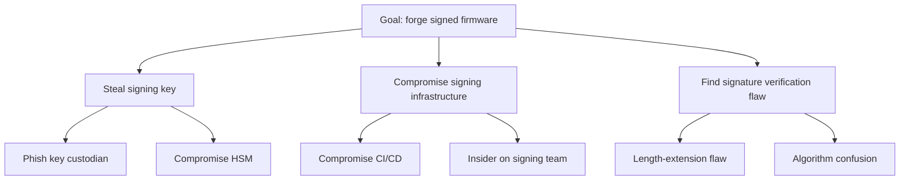

# Methodologies beyond STRIDE

This file covers **full-methodology swaps or supplements** — replacing the STRIDE *categorization lens* with something different (LINDDUN, PASTA, etc.) or adding an output characterization layer (ATT&CK, kill chains).

For the related but distinct question of "what's my **entry point** to enumerate threats?" — asset-centric, flow-centric, process-centric, user-needs-centric, code-centric, attacker-centric — see `centric-methods.md`. The two decisions are independent: you can pair flow-centric generation with STRIDE *or* with LINDDUN, and you can pair STRIDE with flow-centric *or* asset-centric entry. Don't conflate them.

STRIDE is the default categorization in this skill because it's the lingua franca: developers know it, OWASP teaches it, Microsoft tooling supports it, the Threat Modeling Manifesto authors use it. But it's not universal. This file is a quick-reference for when to swap or supplement.

## Decision flow

First decide whether you have a *categorization* problem or an *entry point* problem:

- "I'm not sure what to look at first" → entry-point problem → see `centric-methods.md`.
- "I'm not sure STRIDE is the right lens for what I'm enumerating" → categorization problem → use this file.

Then, for the categorization decision:

```
A specific data type dominates (PHI, signing key, token) — or regulatory framing
is data-typed (HIPAA / GDPR / PCI / FDA)?
  → Use data-centric (NIST SP 800-154) as the entry point — see centric-methods.md.
    STRIDE still works as the per-location lens.

Privacy is the dominant concern (PII/PHI/GDPR-heavy)?
  → Use LINDDUN alongside STRIDE. Often combine with data-centric entry point.

Need business-impact-driven scoring with executive buy-in?
  → Consider PASTA. Heavy process; budget for it.

High-value asset, want to reason adversarially about how it could be stolen/compromised,
and you can characterize the adversary?
  → Add an attack tree for that asset. (Generally avoid for medical-device work.)

Operational threat modeling (detection coverage, threat hunting, IR planning)?
  → MITRE ATT&CK + Cyber Kill Chain — but as a mapping layer over threats already generated.
    Not a substitute for design-time STRIDE.

Modeling at org/portfolio level, not per-system?
  → OCTAVE (process-heavy) or VAST (DevOps-friendly).

System has ML/AI components?
  → STRIDE + AI-specific threat list (prompt injection, model extraction, training-data poisoning, etc.).

Otherwise:
  → STRIDE-Per-Element.
```

## LINDDUN — privacy threat modeling

Privacy counterpart to STRIDE. Categories:
- **L**inking — data points can be tied to the same person.
- **I**dentifying — anonymous data can be re-identified.
- **N**on-repudiation (privacy sense) — a person can't deny an action they wished to make plausibly deniable.
- **D**etecting — an attacker can detect that a record exists / a person is in the dataset.
- **D**ata disclosure — unintended exposure.
- **U**nawareness — user doesn't know what's happening to their data.
- **N**on-compliance — violation of privacy policies / regulations.

When to use: GDPR-heavy systems, health data, location data, surveillance-adjacent systems, anything where "the data is sensitive even if it's not technically a security breach". Use *with* STRIDE, not instead — they cover different concerns.

Site: linddun.org

## PASTA — Process for Attack Simulation and Threat Analysis

Seven stages, business-driven:
1. Define business objectives.
2. Define technical scope.
3. Application decomposition.
4. Threat analysis (intel-driven).
5. Vulnerability and weakness analysis.
6. Attack modeling.
7. Risk and impact analysis.

When to use: regulated enterprise environments, executive-sponsored security programs, situations where threats need to be tied to business impact in dollars before anyone will act on them. Heavy: weeks to months for a real PASTA exercise.

Trade-off: thorough but slow. Don't pick PASTA for a sprint-level review.

## Attack trees

A tree where the root is an attacker goal ("steal the firmware signing key", "fraudulently issue a refund", "modify a CT scan after acquisition") and the children are sub-goals or attack steps. Leaves are atomic actions. Branches are AND (all required) or OR (any sufficient).

Attack trees are **goal/adversary-centric**: they answer "how would an attacker realize this threat" rather than "what threats exist." That distinction matters. They're a complement to a generative method like flow- or asset-centric STRIDE, not a substitute for one.

When to use:
- A specific high-value asset deserves adversarial reasoning, *and* you can name and characterize the adversary.
- You want to evaluate the cost / skill / detection probability of an attack path.
- You need to communicate "how would someone actually do this" to non-security stakeholders.

**When to be cautious:** attack trees are most at home in environments with named, capability-assessed adversaries — government / classified work, nation-state-target finance, defense contractors. **For medical device work in particular, attack trees are usually not the right primary tool.** Most realistic threats to medical devices come from commodity attackers, opportunistic ransomware, or insiders — not characterized APTs. A flow-centric STRIDE pass is more productive in that setting. If you do reach for an attack tree on a medical device, reserve it for one or two of the highest-priority threats (e.g. "how could someone forge a firmware signature") where adversarial reasoning genuinely adds value. Don't draw an attack tree per threat — that's a sign the methodology is being applied for its own sake.

Pair with STRIDE: STRIDE finds the threats, attack trees explore the worst few.

Format in Mermaid:



## MITRE ATT&CK + Cyber Kill Chain

ATT&CK and the Lockheed Martin Cyber Kill Chain are **output characterization layers**, not generative methods — they organize threats you've already generated, they don't enumerate them. For the full framing of characterization layers vs generation methods (and the rest of the catalog: CAPEC, CWE, CVSS, STRIDE-as-characterization), see `centric-methods.md` § "Output characterization layers (these are not entry points)" — that's the canonical place. The ATT&CK / kill-chain specifics:

- **MITRE ATT&CK** — a knowledge base of adversary tactics, techniques, and procedures (TTPs). Catalogs *how* attacks happen rather than telling you which attacks apply to your system.
- **Cyber Kill Chain** — a 7-stage attack lifecycle: Reconnaissance → Weaponization → Delivery → Exploitation → Installation → Command & Control → Actions on Objectives.

You generate threats with one of the centric methods, then optionally *map* them to ATT&CK techniques and kill-chain stages for organizational, communication, or detection-coverage purposes. Mapping ≠ generation.

When to use (as a mapping/characterization layer):
- Designing detection coverage ("which ATT&CK techniques can we see?").
- Threat hunting hypotheses.
- IR playbooks and tabletops.
- Communicating to a SOC.

When *not* to use as the primary lens: greenfield design. ATT&CK assumes a system already exists and adversaries are already operating against it; it's not a design-time generative tool. Use STRIDE (or another design-time lens) for design, ATT&CK for ops. They compose well — a STRIDE Spoofing threat at design time may map to ATT&CK techniques like T1078 (Valid Accounts) at operations time.

## OCTAVE / VAST

**OCTAVE** — Operationally Critical Threat, Asset, and Vulnerability Evaluation. Risk-management-focused, organizational-level, asset-centric. Heavy process. Used in some federal / regulated environments.

**VAST** — Visual, Agile, and Simple Threat modeling. Designed for DevOps and scale; differentiates "application threat models" from "operational threat models". Vendor-aligned with ThreatModeler.

When to use either: portfolio or organization-level risk programs. Not for a single system review.

## ML/AI-specific threats (supplement, not replacement)

For systems with ML/AI components, run STRIDE first, then a supplementary pass for model-specific threats:

- **Prompt injection / jailbreaks** (LLM systems)
- **Training data poisoning** — adversary contributes to training corpus.
- **Model extraction** — querying the model to reconstruct it.
- **Membership inference** — determining if a record was in the training set.
- **Model inversion** — recovering training data from the model.
- **Adversarial examples** — inputs crafted to misclassify.
- **Supply chain on models** — compromised pre-trained weights.

OWASP has a Top 10 for LLM Applications and a Machine Learning Security Top 10 that map to these. Reference, don't reinvent.

## Hybrid as default

This skill's default is **not** a single STRIDE-Per-Element document. The default output is a **hybrid threat model** that draws from every applicable layer the skill knows about, organized into three strata.

The framing is from Tatam et al. (*A review of threat modelling approaches for APT-style attacks*, Heliyon 7 (2021)): no single threat-modeling approach covers all permutations of system, adversary, and operational concern, so mature programs layer multiple methods. The Threat Modeling Manifesto's "Multiple representations" pattern says the same thing more loosely. This skill operationalizes both.

### The three strata

| Stratum | What it covers | What goes in it (from this skill) |
|---------|----------------|------------------------------------|
| **Contextual** (system-specific) | "What's threatening *this* system?" — the design-time, system-level model | Flow-centric DFD + STRIDE-Per-Element (always), plus one or more supplementary entry points (data-centric, asset-centric, user-needs-centric, process-centric), plus LINDDUN if privacy is in scope, plus AI/ML-specific threats if ML components, plus an attack tree on the top 1–2 highest-value threats, plus code-centric as validation if code is available |
| **Operational / Tactical** (generic techniques) | "How would an attacker actually realize these threats? How would we see it?" — adversary TTPs, detection, IR | MITRE ATT&CK mapping for the top threats; Cyber Kill Chain mapping where it clarifies sequencing; CAPEC pattern references where they fit; CWE references where code-centric findings exist; CVSS for any threats that map to known CVEs |
| **Strategic** (sector landscape) | "What does the threat picture for *our sector* look like? Who are the named adversaries and what regimes apply?" | Sector threat-intel pointers (H-ISAC for medical, FS-ISAC for finance, E-ISAC for energy, MS-ISAC for state/local gov, ICS-CERT/CISA advisories for ICS); named-adversary context where one applies; regulatory framing (FDA premarket cybersecurity, IEC 62443, IEC 81001-5-1, HIPAA, GDPR, PCI, ISO 27001); business-impact framing borrowed from PASTA where executive sign-off is needed; org-level context (OCTAVE / VAST) if part of a portfolio review |

Risk rating (qualitative L/M/H by default, or OWASP-RR / FMEA where the org requires it — see `risk-rating.md`) sits *across* the strata: every threat at every layer gets rated on the same scale so they can be merged into one prioritized list.

### Why every output is hybrid (not just complex / regulated systems)

Earlier guidance treated hybrid as something you reach for when a system is "complex enough." That bar is the wrong one — it lets simple-looking systems ship with single-method models that miss whole categories. Even a small internal tool benefits from a contextual supplement (one extra entry point catches what STRIDE-on-DFD misses) and a strategic note (one paragraph: what sector, what regulator, what landscape). The amount of *content* per stratum scales with stakes; the *presence* of all three strata does not.

Minimum viable hybrid for a small system: DFD + STRIDE table + one short supplementary entry-point pass + ATT&CK technique IDs on the top 3 threats + one paragraph of sector / regulatory context. That's still a hybrid. It's still better than a single-method model.

### Decision matrix — which layers, by system type

This is a cheat sheet, not a straitjacket. Always include the "always" cells. Add "often" cells unless there's a clear reason not to. "Sometimes" cells are situational.

| System type | Contextual core (always) | Contextual supplement (always pick at least one) | Operational (always) | Strategic (always) | Often add | Sometimes |
|---|---|---|---|---|---|---|
| Generic web app | flow-centric DFD + STRIDE | user-needs-centric (business logic) | ATT&CK on top threats | OWASP Top 10 framing; sector if regulated | LINDDUN (if PII); CWE on code findings | Process-centric (if ops-heavy); attack tree (one high-value flow) |
| **Medical device / PACS / DICOM** | flow-centric DFD + STRIDE | **data-centric (PHI / device data)** + LINDDUN | ATT&CK; CISA medical advisories | **H-ISAC; FDA premarket cybersecurity; IEC 62443; IEC 81001-5-1; HIPAA; safety-bump rule from `risk-rating.md`** | asset-centric (signing keys); attack tree on safety-critical path | Code-centric on parser/protocol code; named adversary if applicable |
| Cloud-native multi-tenant SaaS | flow-centric DFD + STRIDE | user-needs-centric (tenancy + RBAC); process-centric (deploy / on-call) | ATT&CK; CSP shared-responsibility map | Sector regulator; SOC 2 / ISO 27001 framing | LINDDUN (if PII); asset-centric (signing keys, KMS roots) | Attack tree on tenant-isolation breach |
| ICS / SCADA / OT | flow-centric DFD + STRIDE | asset-centric (control loop, HMI, PLC) + process-centric | ATT&CK for ICS; kill chain | **E-ISAC; CISA ICS-CERT advisories; IEC 62443; named-adversary context (sector is targeted)** | Attack tree (one safety-critical path) | LINDDUN if operator PII; data-centric on setpoint integrity |
| Embedded / IoT | flow-centric DFD + STRIDE | data-centric (firmware image; device keys); asset-centric | ATT&CK | Sector regulator; supply-chain framing (SBOM, signed firmware) | Code-centric on bootloader / parser; attack tree on firmware-signing bypass | LINDDUN if device collects PII |
| AI / ML system | flow-centric DFD + STRIDE | **data-centric (training data; model weights)** + AI/ML-specific threat list (prompt injection, model extraction, training-data poisoning, etc.) | ATT&CK; OWASP LLM Top 10; OWASP ML Security Top 10 | Sector framing; AI-specific regulator (EU AI Act, NIST AI RMF) | LINDDUN (if PII in training data); attack tree on model extraction | Code-centric on inference pipeline |
| Greenfield internal tool, low stakes | flow-centric DFD + STRIDE | asset-centric (single-pass, light) | ATT&CK on top 3 threats | One paragraph: sector + regulator | — | (keep light) |

### How the strata nest in the output document

Two valid shapes; pick by audience.

**Single-document hybrid (default).** All strata in one markdown file, with the document structure from SKILL.md § "Producing the threat model". Section 2 ("What can go wrong?") gets nested subsections — 2.1 Contextual, 2.2 Operational, 2.3 Strategic — and threats from each stratum share a single ID space and a single risk-rating scale so Section 3 ("What are we going to do about it?") can prioritize across them. This is what most engineering teams want.

**Linked-documents hybrid.** Contextual stratum lives in the per-system threat model file; Operational stratum lives in a SOC-owned ATT&CK / detection coverage doc; Strategic stratum lives in a program- or org-level threat landscape doc. The per-system doc *links* to the operational and strategic docs rather than embedding them. Use this when the strata are owned by different teams and updated on different cadences (typical of larger orgs with a separate CTI / SOC function). The per-system doc still references the higher strata explicitly — never leave them out, even when they live elsewhere.

In either shape: cross-reference threats across strata by ID. *"V3 (data-centric) ≈ T7 (flow-centric); maps to ATT&CK T1119 (Automated Collection); within-sector precedent: H-ISAC advisory 2023-07."* That's the chain that makes a hybrid actually hybrid rather than three disconnected lists.

### Pruning

Hybrid's failure mode is producing more documentation than the team will read. Two pruning rules:

1. **Don't repeat threats across strata** — cross-reference instead. If the same finding shows up in flow-centric, data-centric, and ATT&CK mapping, it gets one ID, one row in the prioritized list, and pointers from the other strata.
2. **Drop the stratum's section if there's genuinely nothing to add** — but say so explicitly ("Strategic: not applicable; this is a single-tenant internal tool with no sector adversary"). Silent omission is the anti-pattern; deliberate omission is fine.

### Worked example

A worked hybrid example for a DICOM PACS lives in `data-centric.md` § "Worked example" (the contextual data-centric stratum) and is referenced from `dfd-mermaid.md` § "Worked example" (the contextual flow-centric stratum). Together they show the contextual-stratum layering. For the operational and strategic strata of the same system, the pattern is: ATT&CK technique IDs on the V1–V5 vectors and on the corresponding flow-centric threats; H-ISAC + FDA premarket cybersecurity + IEC 81001-5-1 references in a one-paragraph strategic section.
