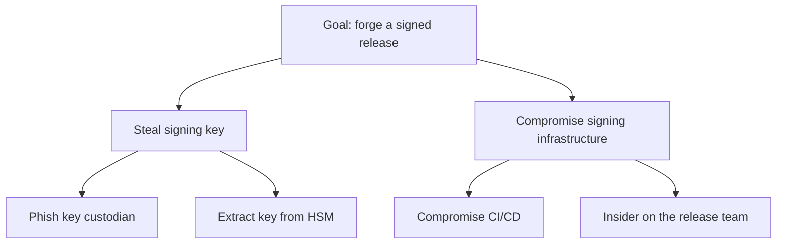

# Going beyond STRIDE

STRIDE applied per element of a DFD is the default in this skill — it's what OWASP teaches, what most engineers know, and it pairs naturally with the DFD. It is not the only tool, and it is not always enough. This file is the menu of supplements.

Use it as a decision aid, not a checklist. Most threat models need STRIDE plus *zero, one, or two* of the things below. Adding all of them is the bloat the skill exists to avoid.

## Which supplement, when

| If the system has… | Add… |
|---|---|
| PII, health, location, or other privacy-sensitive data | **LINDDUN** — privacy threats |
| One dominant sensitive data class, or data-typed regulation (HIPAA/GDPR/PCI) | **Data-centric** (NIST SP 800-154) |
| Rich business logic, multiple roles, delegation/approval flows | **Abuse cases** (user-needs inversion) |
| Significant operational surface (deploys, on-call, key rotation) | **Process-centric** enumeration |
| A small set of crown-jewel assets | **Asset-centric** enumeration; an **attack tree** on the top one |
| ML/AI components | **AI/ML threat pass** |
| A detection / SOC / IR audience | **MITRE ATT&CK** mapping; **CAPEC → CWE** for traceability |
| Safety-critical control loops (medical, ICS, automotive, robotics) | **STPA-SafeSec** — see `safety-critical.md` |
| Executive sign-off gated on business impact | Borrow **PASTA**'s business-impact stage |
| An org/portfolio-level review, not a single system | **OCTAVE** or **VAST** |

## Where to start enumerating (entry points)

STRIDE is a *lens* — it categorizes the threats you find. It still needs an *entry point* — the thing you look at first. STRIDE-on-a-DFD enters from data flows (flow-centric). Other entry points are equally valid and you can run more than one:

- **Flow-centric** — walk the DFD elements. The default; widest coverage.
- **Asset-centric** — start from crown-jewel assets, work backwards. Good when a few high-value things dominate. Weak when "everything is sensitive". (Shostack's caution: asset enumeration tends to bog down in arguments about what counts as an asset — assets are best for *prioritizing* found threats, not finding them.)
- **Data-centric** — pick one data class, walk its lifecycle. See below.
- **Process-centric** — walk operational workflows (deploy, on-call, rotation). Catches time-dependent threats STRIDE misses.
- **User-needs-centric** — invert user stories into abuse cases. Catches business-logic flaws.
- **Code-centric** — read the implementation. This is *validation*, not generation: it produces ground truth that can confirm or refute the model's assumptions. Don't use it as the threat model itself.

Supply-chain and deployment threats don't need their own methodology — a build server is an asset, a CI/CD pipeline is a process, a signed-artifact flow is a flow. The gap, when it exists, is an inventory gap (you left them out of the DFD), not a methodology gap.

## LINDDUN — privacy

The privacy counterpart to STRIDE. Seven categories:

- **L**inking — data points can be tied to the same person.
- **I**dentifying — anonymous data can be re-identified.
- **N**on-repudiation (privacy sense) — a person can't plausibly deny an action they wanted deniable.
- **D**etecting — an attacker can tell a record exists or a person is in a dataset.
- **D**ata disclosure — unintended exposure.
- **U**nawareness — the user doesn't know what's happening to their data.
- **N**on-compliance — violation of privacy policy or regulation.

Use it *alongside* STRIDE when privacy is a real concern — GDPR-heavy systems, health or location data, anything surveillance-adjacent. STRIDE's "Information disclosure" is one coarse bucket; LINDDUN is seven. Site: linddun.org.

## Data-centric (NIST SP 800-154)

Pick **one** data class (a session token, a customer record, a signing key) and walk its lifecycle. From NIST SP 800-154 (Draft, 2016):

1. **Characterize the data.** Name the class and its custodian. Name which security objectives matter — and explicitly drop the ones that don't (public data needs no confidentiality; ephemeral telemetry needs no integrity). Enumerate the authorized locations it lives in: storage, transmission, execution, input, output.
2. **Identify attack vectors** per location, against the in-scope objectives. Include cross-location leaks — data escaping an authorized location into an unauthorized one.
3. **Characterize controls** — existing and proposed, mapped to vectors.
4. **Analyze** — residual risk, gaps, what to mitigate vs. accept.

The payoff over flow-centric: it catches lifecycle-only locations a DFD doesn't draw — process memory, core dumps, debug logs, swap, an operator's clipboard. Number these vectors `V1`, `V2`, … and cross-reference flow-centric threats (`V3 ↔ T7`) rather than duplicating.

One data class per pass. Modeling "all PII plus all credentials plus all configs" at once defeats the method — the discipline is the narrow scope. For multiple classes, run multiple passes.

## Abuse cases (user-needs inversion)

Take each user story — "a user can export a report" — and invert it: "what if a *different* user does this? an *unauthorized* user? a user against a target they shouldn't reach?" Generates business-logic threats in specific language ("a user can view another tenant's drafts" beats "broken access control"). Best for multi-tenant SaaS, workflow-heavy apps, anything with delegation or approval. Pair with flow-centric for asset context.

## Attack trees

A tree whose root is an attacker goal ("steal the signing key", "issue a fraudulent refund") and whose children are sub-goals and steps, combined with AND/OR. Goal-centric: answers "how would an attacker realize *this* threat", not "what threats exist" — a complement to a generative method, not a substitute.

Use one when a specific high-value asset deserves adversarial reasoning *and* you can characterize the adversary, or when you need to communicate "how would someone actually do this" to non-security stakeholders. Don't draw an attack tree per threat — that's methodology for its own sake. One or two, on the highest-value targets.



## ATT&CK and the kill chain

**MITRE ATT&CK** is a catalog of adversary tactics and techniques. **The Cyber Kill Chain** (Lockheed Martin) is a 7-stage attack lifecycle. Both *characterize* threats you've already found — they organize, they don't generate. Map threats to ATT&CK technique IDs when the audience is a SOC or IR team, or when you're designing detection coverage. Don't use ATT&CK as the design-time generative lens; it assumes a running system and active adversaries.

## CAPEC → CWE for traceability

**CAPEC** (MITRE) is a catalog of attack patterns; each pattern lists the **CWE** weaknesses it exploits. When a team wants derived security requirements traceable to a known weakness class — common in regulated work — map a threat through the chain:

```
STRIDE category → CAPEC pattern → CWE(s) it exploits → mitigation
```

A requirement that cites "closes CWE-287" is more defensible than one derived from a free-text threat sentence. CAPEC patterns come at three abstraction levels (Meta / Standard / Detailed); cite the level that matches what you actually know — Standard for most design-review work, and say so if you're citing the closest fit because no exact pattern exists (CAPEC's coverage of domain-specific protocols is patchy). This chain is worth the effort when traceability is a requirement; it's overhead when it isn't.

## AI/ML threats

For systems with ML/AI components, run STRIDE first, then a supplementary pass for model-specific threats:

- Prompt injection / jailbreaks (LLM systems)
- Training-data poisoning
- Model extraction (reconstructing the model by querying it)
- Membership inference (was this record in the training set?)
- Model inversion (recovering training data from the model)
- Adversarial examples (inputs crafted to misclassify)
- Supply chain on models (compromised pre-trained weights)

OWASP publishes a Top 10 for LLM Applications and a Machine Learning Security Top 10 — reference those, don't reinvent them.

## PASTA, OCTAVE, VAST

- **PASTA** — Process for Attack Simulation and Threat Analysis. Seven business-driven stages. Thorough but heavy (weeks to months). Borrow its business-impact stage when executive sign-off depends on tying threats to dollars; don't run all seven for a sprint review.
- **OCTAVE** — organizational, asset-centric risk management. Heavy process.
- **VAST** — Visual, Agile, Simple; built for DevOps scale, vendor-aligned with ThreatModeler.

OCTAVE and VAST are for org/portfolio-level programs, not single-system reviews.

## Optional: organizing a large model into strata

For a large model that genuinely serves multiple audiences, one way to *organize* it is into three strata (Tatam et al., *A review of threat modelling approaches for APT-style attacks*, Heliyon 7, 2021):

- **Contextual** — system-specific threats (the DFD + STRIDE + any supplements above).
- **Operational** — generic adversary techniques (ATT&CK, kill chain, CAPEC/CWE).
- **Strategic** — sector landscape (threat intel, named adversaries, regulatory framing).

This is an editorial structure, not a practitioner consensus — it's one paper's synthesis. Use it if it helps a big model stay navigable for distinct readers. For most threat models it is unnecessary structure; a single flat document organized by the four questions is clearer. Don't impose three strata on a system that doesn't need them, and never ship empty strata — that's the checkbox-compliance anti-pattern.
