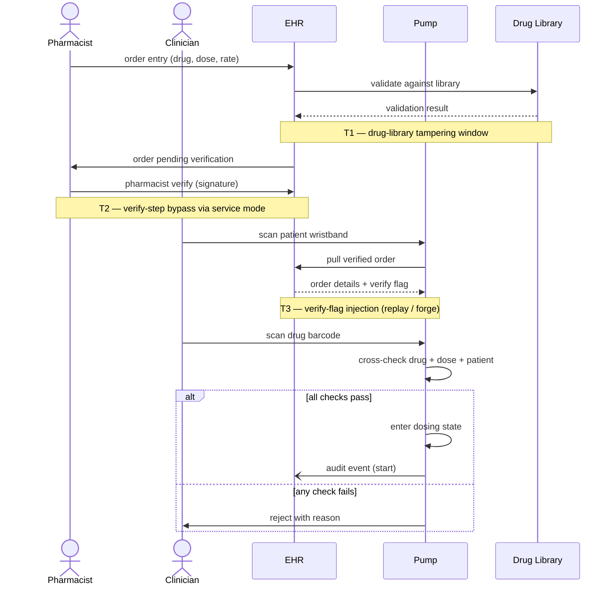
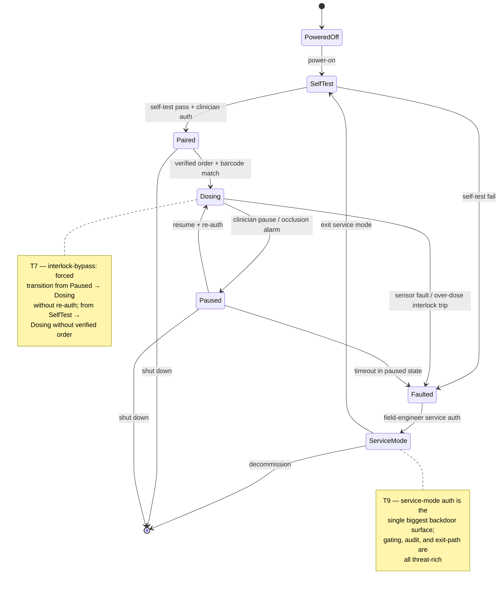

# Non-DFD diagram types — swim lanes and state diagrams

> **Last verified**: 2026-05. Mermaid `sequenceDiagram` and `stateDiagram-v2` are stable across Mermaid v9–v11; re-confirm against the live Mermaid docs if a deliverable target depends on a specific renderer version.
> **Sources paraphrased**: MITRE Threat Modeling Playbook (Toreon, OWASP) §2.3.2 (sequence / swim-lane diagrams), §2.3.3 (state diagrams) — "Leveraging Multiple Modeling Techniques". Threat Modeling Manifesto "Multiple representations" pattern (CC-BY 4.0). Mermaid syntax (mermaid-js.github.io, MIT licensed).

> **Related**: ← `SKILL.md` § "Producing the threat model" • `dfd-mermaid.md` (DFDs are the contextual core; this file is a supplement) • `medical.md` § "Clinical workflow misuse" (sequence diagrams are the right home for clinical workflow threats) • `manifesto.md` § "Multiple representations" pattern (this file is the operationalization).

The skill's contextual core is a flow-centric DFD. DFDs are good at "what data moves where, across which trust boundaries" — and bad at two things:

1. **Ordered, multi-actor workflows.** A DFD shows that a clinician and a pharmacist both touch the infusion pump's drug library; it doesn't show that the pharmacist must verify *before* the clinician administers, and that the verification check is the threat-rich step.
2. **Internal state machines.** A DFD shows the pump exists; it doesn't show that the pump has six modes (powered-off / paired / dosing / paused / fault / service) and that the dosing↔fault transition is where interlock checks live.

Both gaps are well-served by a second diagram alongside the DFD. The MITRE Threat Modeling Playbook §2.3.2–2.3.3 explicitly recommends layering DFD + sequence (swim lane) + state diagrams — one model per concern, cross-referenced. This file is the operationalization for Mermaid.

## Decision rule — when to add which

Add a swim-lane / sequence diagram when **any** of these is true:

- The system has a clinical, operational, or business workflow with three or more ordered steps across two or more actors (medication administration; surgical timeout; dispatch-to-delivery; loan approval; deploy-to-production).
- Authorization or interlock checks are step-ordered ("pharmacist must verify before clinician administers"; "two-person rule"; "approver must sign before deployer can push").
- A "service mode" or emergency-override path bypasses the normal step ordering.
- Replay, reorder, or out-of-order-execution attacks are plausible (the DFD can't show ordering, so it can't show that an attacker who reorders steps wins).

Add a state diagram when **any** of these is true:

- The device or service has named operational modes with documented transitions (powered-off / paired / dosing / fault; not-authenticated / authenticated / mfa-pending / locked-out).
- Authentication, interlock, or safety checks are gated on entering a state, not on a request being received (most safety-critical embedded systems work this way).
- Failure or fault modes have their own transitions and the recovery path is part of the threat surface (fault → service-mode is a classic backdoor).

A DFD without one of these supplements is sufficient for plain web apps and stateless services. For medical devices, OT/ICS, automotive, robotics, multi-step approval workflows, and anything with a documented state machine, the supplement is usually warranted.

Both supplements are *additions* to the DFD, never replacements. The DFD remains the contextual core; the sequence and state diagrams sit underneath it in §1, with explicit cross-references from threat IDs in §2 to the diagram element they target ("T7 — replay of step 4 in the medication-administration sequence (Figure 3, swim-lane crossing); see also DFD flow `Pump → EHR audit`").

## Sequence / swim-lane diagrams (Mermaid `sequenceDiagram`)

Mermaid's `sequenceDiagram` renders as a swim lane: each actor / participant is a vertical lane, time flows top-to-bottom, messages are arrows between lanes. Use it when ordering matters.

### Element mapping

| Concept | Mermaid syntax | Notes |
|---|---|---|
| Actor (human, role) | `actor Clinician` | Renders as a stick figure |
| Participant (system, service) | `participant Pump` | Renders as a labeled box |
| Synchronous message | `Clinician->>Pump: scan barcode` | Solid arrow with filled head |
| Asynchronous message | `EHR-)Pump: write audit event` | Open arrow head |
| Reply | `Pump-->>Clinician: confirmation` | Dashed arrow |
| Activation lifeline | `activate Pump` / `deactivate Pump` | Optional; useful for showing where compute happens |
| Note (annotation) | `Note over Pump: enters dosing state` | Use to call out the threat-rich step |
| Loop / alt / opt | `loop / alt / opt ... end` | Use for retries, branches, optional steps |

### Worked example — medication administration with two-person check

What this diagram makes visible that the DFD doesn't:

- **The verification step is ordered.** A DFD shows EHR ↔ Pump; the swim lane shows that the pharmacist's verification *must* precede the clinician's administration. An attacker who can administer without that verification flag wins — and the threat (T3 in the diagram) is "inject a forged verify flag," which a DFD alone can't even ask.
- **The threat-rich crossings are step-ordered.** T1 sits in the validation round-trip; T2 sits in the human-verification step (and is where service-mode-as-backdoor lives); T3 sits in the order-pull. Each `Note over` line in the diagram becomes a §2 threat row; the diagram and the threat table are co-registered.
- **The `alt` block is the safety gate.** "All checks pass → enter dosing" vs "any check fails → reject" is the interlock; in the DFD it's invisible. In the swim lane it's the single most-attacked branch.

### Conventions for sequence diagrams

- **Lanes are actors and systems, not zones.** Trust zones are a DFD concern; lanes are participants. If you need to show a trust crossing in a sequence diagram, annotate it with a `Note over` rather than drawing a boundary shape — boundaries are awkward in sequence diagrams and the DFD already has them.
- **Time flows top-to-bottom; don't violate it.** If your diagram has an arrow going backward (a later step reaching back to an earlier participant out of order), you've found either an inconsistency or a real threat (replay / out-of-order execution); call it out explicitly.
- **Annotate the threat-rich steps with `Note over`.** Each `Note` becomes a §2 threat-table row, with the threat ID (T1, T2, …) carried into the note.
- **Keep it one workflow per diagram.** Two workflows in one swim lane is an eye chart. Make Figure 3 the medication-administration flow, Figure 4 the alarm-acknowledgment flow.

## State diagrams (Mermaid `stateDiagram-v2`)

Mermaid's `stateDiagram-v2` renders a state machine: states as boxes, transitions as labeled arrows, with start (`[*]`) and end (`[*]`) markers. Use it when the system has named operational modes whose transitions matter for security or safety.

### Element mapping

| Concept | Mermaid syntax | Notes |
|---|---|---|
| State | `Dosing` (bare identifier) or `state "Display Name" as id` | Use display names for human-readable labels |
| Initial state | `[*] --> PoweredOff` | One initial transition per machine |
| Terminal state | `Faulted --> [*]` | Optional; most embedded systems have no terminal state |
| Transition | `Paired --> Dosing : start infusion (auth check)` | Always label the trigger and any precondition |
| Composite state | `state Operational { ... }` | Group sub-states under a parent (e.g. all dosing-related sub-states) |
| Note on a state | `note right of Dosing : T7 — interlock-bypass attack lands here` | Use to mark threat-rich states or transitions |
| Choice / fork | `state choice <<choice>>` | For conditional transitions |

### Worked example — smart infusion pump state machine

What this diagram makes visible that the DFD doesn't:

- **Authentication is gated on transitions, not on requests.** "Verified order + barcode match" is the *transition* into Dosing — an attacker who can drive that transition without the gate (force-set the state, replay an old transition message, exploit a self-test → dosing shortcut) bypasses the gate. The DFD can't show this; the state diagram is where the gates live.
- **Service mode is a state, not a flow.** A DFD shows "vendor remote support" as one external entity; the state diagram shows that ServiceMode is a *device state* with elevated privileges, an entry gate (auth), and an exit gate (return to SelfTest). Each gate is a threat-table row.
- **Fault → ServiceMode is the backdoor path.** This is the single most-overlooked threat in medical-device state machines: a forced fault gives the attacker a path to elevated privilege via the documented service workflow. STRIDE walks the transition; the diagram makes the transition visible.

### Conventions for state diagrams

- **One state machine per diagram.** A pump has *one* state machine, even if it has many sub-modes. If you have two unrelated state machines (the pump's operational state + the BLE pairing state), draw two diagrams. Composite states (`state Operational { ... }`) are how you nest *related* sub-states inside one machine.
- **Every transition is labeled with its trigger and its gate.** "start infusion (auth check)" — both the event and the precondition. A transition without a gate is either trusted or missing one; either way, call it out in §2.
- **Annotate threat-rich states / transitions with `note`.** Each note becomes a §2 threat-table row (T7, T9, …). The diagram and the threat table are co-registered — same as for sequence diagrams.
- **Show the backdoor / recovery transitions.** Service mode, factory reset, fault → service, "forgot my password" recovery — these are the transitions attackers reach for. If your diagram is missing them, you've drawn the happy path, not the threat surface.

## Cross-references and §2 integration

Threats discovered in a sequence or state diagram live in the same §2 threat table as DFD-discovered threats — one ID space, same `AV / PR / AC + CIA` enums. The diagram of origin is recorded in the row's *Element* column or footnoted:

| ID | Element | STRIDE | Threat | CAPEC | CWE | … | AV | PR | AC | Impact |
|----|---------|--------|--------|-------|-----|---|----|----|----|--------|
| T7 | State `Dosing` (Figure 4 — pump state machine) → H-2 | T | **Forced transition into Dosing**: An attacker forces a `SelfTest` → `Dosing` transition that bypasses the verified-order gate, starting an infusion that was never confirmed. | CAPEC-74 (Manipulating State) | CWE-372 | … | A | N | L | I, A |
| T9 | State `ServiceMode` (Figure 4) | E | **Service-mode credential abuse**: An attacker uses static or shared field-engineer credentials to enter service mode, the device's privilege-elevation path. | CAPEC-560 (Use of Known Domain Credentials) | CWE-798 | … | L | L | L | C, I, A |
| T3 | EHR → Pump message in step 5 (Figure 3 — medication-administration sequence) → H-2 | T | **Forged pharmacist-verified flag**: An attacker injects or replays the order-pull message to forge a "pharmacist verified" claim the pump trusts. | CAPEC-272 (Protocol Manipulation) | CWE-345 | … | A | N | L | I |

This is what the Manifesto's "Multiple representations" pattern looks like operationally: three diagrams, one threat table, one prioritized §3 list. The diagrams differ; the threats they surface live in one place.

## Anti-patterns

- **Drawing both diagrams when one is enough.** A simple stateless web service doesn't need a state diagram; a one-step request flow doesn't need a sequence diagram. Add the supplement when the DFD can't carry the threat type, not by default.
- **Letting the supplement supplant the DFD.** The DFD is the contextual core. Sequence and state diagrams support it; they don't replace it. A threat model with only a state diagram is incomplete because it can't show trust boundaries.
- **Drawing the happy path.** The reason to draw a sequence or state diagram is to find threats — that means including the failure paths, the override paths, and the recovery transitions. A diagram that shows only the green path is a marketing diagram.
- **Eye-chart sequence diagrams.** More than ~12 messages or ~6 lanes and the diagram stops being readable. Decompose: one sequence per workflow.
- **Unlabeled transitions.** A state-diagram arrow with no label says "something happens here." That's not a model; it's a sketch. Label every transition with its trigger and gate.
